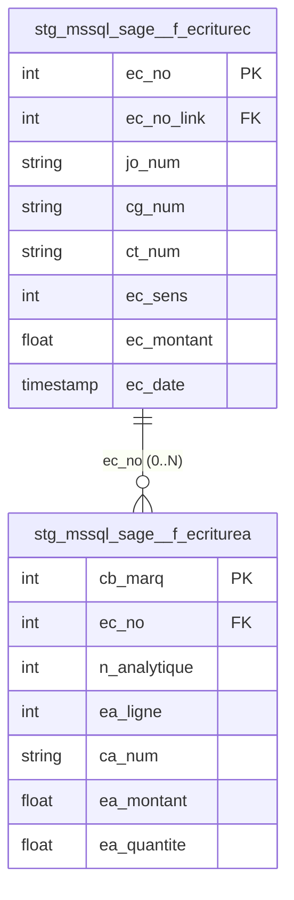
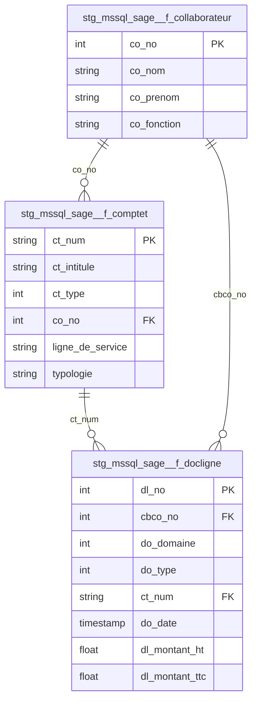
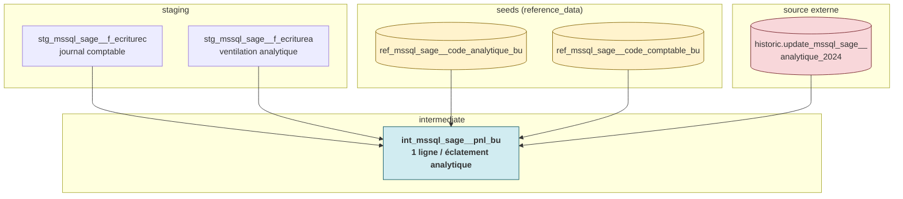

# Architecture — MSSQL Sage

> Dernière mise à jour : 2026-05-19

---

## Vue d'ensemble

Sage est l'ERP comptable et commercial du groupe. Ce pipeline extrait les
données de la base **MSSQL Sage** via Meltano (cadencement quotidien) et les
rend disponibles dans BigQuery pour le **pilotage financier** (P&L par
Business Unit) et l'analyse commerciale Nunshen.

Le pipeline couvre **deux domaines fonctionnels indépendants** qui partagent
seulement la base Sage comme système source :

**1. Comptabilité / P&L (toutes BU)**
- **Écritures comptables** (`f_ecriturec`) — journal comptable officiel
- **Écritures analytiques** (`f_ecriturea`) — ventilation des écritures sur les axes analytiques (BU, projets…)

**2. Commerce Nunshen (BU Nunshen uniquement)**
- **Comptes clients** (`f_comptet`) — clients Nunshen
- **Lignes de vente** (`f_docligne`) — détail des ventes Nunshen
- **Collaborateurs** (`f_collaborateur`) — commerciaux Nunshen

> **Important** : ces deux blocs ne sont **pas reliés fonctionnellement**.
> Le `ct_num` présent dans `f_ecriturec` représente n'importe quel tiers
> Sage (clients toutes BU + fournisseurs), tandis que `f_comptet` ne contient
> que les clients Nunshen. Une jointure sur `ct_num` entre ces deux blocs
> est techniquement possible mais sémantiquement piégeuse.

Cas d'usage principal : le mart `fct_mssql_sage__pnl_bu_kpis` produit un
**P&L mensuel par BU** avec budget, YTD, N-1 et écarts, alimenté par Power BI.

---

## Flux de données

```
┌─────────────────┐    Meltano (tap-mssql) ┌──────────────────────┐
│   MSSQL Sage    │ ─────────────────────► │  prod_raw (BigQuery) │
│   (on-prem)     │   daily full refresh   │  mssql_sage.dbo_*    │
└─────────────────┘   (docligne incremental)└─────────┬───────────┘
                                                     │ dbt staging
                                                     ▼
                                       ┌──────────────────────────┐
                                       │  staging                 │
                                       │  stg_mssql_sage__*       │
                                       │  table                   │
                                       └──────────┬───────────────┘
                                                  │
                              + seeds + source historic
                                                  │
                                                  ▼
                                       ┌──────────────────────────┐
                                       │  intermediate            │
                                       │  int_mssql_sage__pnl_bu  │
                                       └──────────┬───────────────┘
                                                  │
                              + seed ref_mssql_sage__pnl_budget
                                                  │
                                                  ▼
                                       ┌──────────────────────────┐
                                       │  marts                   │
                                       │  fct_mssql_sage__         │
                                       │     pnl_bu_kpis           │
                                       └──────────────────────────┘
```

**Ce que fait chaque couche :**

| Couche | Rôle | Localisation |
|---|---|---|
| `prod_raw` | Données brutes Sage. Trois tables sont stockées **en colonne JSON** (`data`) — voir gotchas | `evs-datastack-prod.prod_raw` |
| `staging` | Cast des types, extraction des JSON, gestion du placeholder de date Sage `1753-01-01`, harmonisation des timestamps | `evs-datastack-prod.prod_staging` |
| `intermediate` | Jointure écritures comptable ↔ analytique + résolution de la BU via seeds + fallback regex + override historique 2024 | `evs-datastack-prod.prod_intermediate` |
| `marts` | KPIs P&L mensuels avec budget, YTD, N-1, écarts et scénarios (avec/sans provisions CP) | `evs-datastack-prod.prod_marts` |

**Fraîcheur (source freshness)** : tier *Standard* — warn 26h / error 36h sur
`_sdc_extracted_at` (sauf `f_ecriturea` et `f_ecriturec` qui utilisent
`_sdc_received_at`).

---

## Notions Sage utiles

Quelques notions de comptabilité française que ce pipeline manipule :

| Notion | Colonne staging | Explication |
|---|---|---|
| Compte général (`cg_num`) | `stg_mssql_sage__f_ecriturec.cg_num` | Plan Comptable Général. `6xxxxx` = charges, `7xxxxx` = produits. Le pipeline filtre **uniquement les classes 6 et 7** au niveau intermediate. |
| Compte tiers (`ct_num`) | `stg_mssql_sage__f_ecriturec.ct_num` / `f_comptet.ct_num` | Code client ou fournisseur. Tous les `f_comptet` sont des **clients Nunshen**. |
| Code analytique (`ca_num`) | `stg_mssql_sage__f_ecriturea.ca_num` | Axe analytique : préfixe identifiant la BU (NUN, HOR, OFF, NES, SAV, COM, PDET…). |
| Sens d'écriture (`ec_sens`) | `stg_mssql_sage__f_ecriturec.ec_sens` | **0 = débit, 1 = crédit** (valeurs réelles vérifiées). La description du YAML staging mentionnant "1/2" est obsolète. |
| Écriture comptable vs analytique | `f_ecriturec` (1 ligne) ↔ `f_ecriturea` (0..N lignes) | Une écriture comptable peut être ventilée sur **plusieurs lignes analytiques** (split BU). Inversement, certaines écritures n'ont pas de pendant analytique → `is_missing_analytical` dans l'intermediate. |
| Placeholder date Sage | toute date Sage | Sage écrit `'1753-01-01'` pour "pas de date" → converti en `NULL` dans le staging. |

---

## Modèle de données

### Diagramme des relations

Les deux domaines fonctionnels sont représentés séparément — il n'existe
pas de FK exploitable entre eux.

### Domaine Comptabilité / P&L



`ct_num` est exposé sur `f_ecriturec` mais représente n'importe quel tiers
Sage (client toutes BU ou fournisseur). Aucun référentiel tiers global n'est
extrait dans ce pipeline.

### Domaine Commerce Nunshen



---

## Rôle de chaque table

### Comptabilité / P&L

| Table | Ce qu'elle contient | Lignes (~) |
|---|---|---|
| `stg_mssql_sage__f_ecriturec` | **Journal comptable.** Une ligne = une écriture comptable. Partitionné sur `ec_date`, clusterisé sur `ec_no, cg_num`. | 302 523 |
| `stg_mssql_sage__f_ecriturea` | **Ventilation analytique.** Une ligne = un éclatement d'une écriture comptable sur un axe analytique (BU). Partitionné sur `created_at`, clusterisé sur `ec_no`. | 187 011 |

### Référentiels commerciaux (Nunshen)

| Table | Ce qu'elle contient | Lignes (~) |
|---|---|---|
| `stg_mssql_sage__f_comptet` | Comptes clients Nunshen. Source raw stockée **en JSON** (colonne `data`). | 12 156 |
| `stg_mssql_sage__f_collaborateur` | Commerciaux Nunshen. Source raw stockée **en JSON**. | 166 |
| `stg_mssql_sage__f_docligne` | Lignes de documents Sage (ventes + achats + stock). Filtrer `do_domaine = 0` pour les ventes pures. Source raw stockée **en JSON**. Partitionné sur `do_date`. Matérialisé en `table` (full refresh). | 326 910 |

---

## Jointures clés

### Cas d'usage typiques

**Écriture comptable avec sa ventilation analytique :**
```sql
select
    c.ec_no,
    c.ec_date,
    c.ec_intitule,
    c.cg_num,
    c.ec_sens,                       -- 0 = débit, 1 = crédit
    c.ec_montant,
    a.n_analytique,
    a.ea_ligne,
    a.ca_num                         as code_analytique,
    a.ea_montant                     as montant_analytique
from stg_mssql_sage__f_ecriturec c
left join stg_mssql_sage__f_ecriturea a
    on a.ec_no = c.ec_no
where left(cast(c.cg_num as string), 1) in ('6', '7')   -- charges et produits uniquement
```

**Ventes Nunshen avec client et commercial :**
```sql
select
    d.dl_no,
    d.do_date,
    d.do_piece,
    d.dl_design,
    d.dl_montant_ht,
    cl.ct_intitule                   as client_name,
    cl.categorisation_niv_1,
    coll.co_nom || ' ' || coll.co_prenom as commercial
from stg_mssql_sage__f_docligne d
left join stg_mssql_sage__f_comptet      cl   on cl.ct_num = d.ct_num
left join stg_mssql_sage__f_collaborateur coll on coll.co_no = d.cbco_no
where d.do_domaine = 0          -- 0 = ventes (exclut stock interne et achats)
  and d.do_date >= '2026-01-01'
```

**P&L direct depuis le mart (cas Power BI) :**
```sql
select annee, mois, bu, kpi, valeur, budget, ecart_vs_budget
from prod_marts.fct_mssql_sage__pnl_bu_kpis
where scenario = 'AVEC_PROVISIONS_CP'
  and annee = 2026
  and kpi in ('CA', 'MARGE_BRUTE', 'MARGE_NETTE')
```

---

## Points d'attention

### 3 tables sont stockées en JSON brut côté Sage
`dbo_f_comptet`, `dbo_f_collaborateur` et `dbo_f_docligne` arrivent dans
`prod_raw` avec **une seule colonne `data`** (string JSON) au lieu d'un
schéma tabulaire. Le staging extrait chaque champ via `json_value(data, '$.XXX')`.
Conséquences :
- Pas de typage à la source — tout est cast explicitement en staging.
- Pour ajouter un champ, modifier le staging (pas de colonne à exposer
  côté source).
- Les noms de propriétés JSON respectent la casse Sage (`CT_Num`, `cbCO_No`,
  `cbCreation`, etc.) avec parfois des espaces (`"CATEGORISATION NIV 1"`).

### Placeholder de date Sage : `1753-01-01`
Sage utilise `1753-01-01` (date minimale SQL Server) comme placeholder
"pas de date". Le staging `f_ecriturec` convertit explicitement ces valeurs
en `NULL` pour `ec_echeance`, `ec_date_rappro` et `ec_date_regle`. À
reproduire si tu ajoutes une nouvelle colonne date issue de Sage.

### Sens d'écriture : valeurs réelles 0 / 1 (pas 1 / 2)
La description du YAML staging dit "1 = débit, 2 = crédit" mais les valeurs
réellement en base sont **0 (débit, 141 k lignes) et 1 (crédit, 161 k lignes)**.
Le mart et l'intermediate utilisent bien 0/1 dans leurs `case when`. La doc
YAML est à corriger.

### Résolution de la BU : seed prioritaire + fallback regex
Dans `int_mssql_sage__pnl_bu`, la Business Unit d'une écriture analytique
est déterminée par cascade :
1. **Seed** `ref_mssql_sage__code_analytique_bu` (mapping explicite `code → BU`)
2. **Fallback regex** sur le préfixe du code analytique :
   - `NUN%` → NUNSHEN
   - `HOR%`, `OFF%`, `COM%` → COMMERCE
   - `NES%` → NESHU
   - `SAV%` → TECHNIQUE
   - `PDET%` → PIECES DET
3. **Override historique** : la source `historic.update_mssql_sage__analytique_2024`
   réécrit la BU sur les écritures 2024 lorsqu'un mapping y est défini.

BU produites aujourd'hui (>= 2023) : COMMERCE (39 k), NESHU (24 k), NUNSHEN
(24 k), SUPPORT (19 k), TECHNIQUE (11 k), PIECES DET (654), ZSITUATION (344),
**et 310 lignes sans BU** (flag `is_missing_bu_mapping = true` à surveiller).

### Le signe du montant analytique est appliqué côté mart
Le staging garde `ea_montant` brut. C'est l'intermediate qui calcule
`montant_analytique_signe` selon la convention :
- classe 6 (charges) + débit (0) → **négatif**
- classe 6 + crédit (1) → **positif** (rare : annulation de charge)
- classe 7 (produits) + débit (0) → **négatif** (rare : annulation de produit)
- classe 7 + crédit (1) → **positif**

Cela permet de sommer directement le `montant_analytique_signe` pour
obtenir un P&L net (CA - charges).

### Couverture des FK intra-domaine
Comparaison faite via MCP — taux de match réel des relations à l'intérieur
de chaque domaine :

| Relation | Taux de match | Interprétation |
|---|---|---|
| `f_ecriturea.ec_no → f_ecriturec.ec_no` | testé en staging (100 % attendu) | Toute écriture analytique vient d'une écriture comptable |
| `f_docligne.ct_num → f_comptet.ct_num` (domaine 0) | 100 % attendu | Voir gotcha ci-dessous : sans filtrage `do_domaine = 0`, 30 % d'orphelins illusoires |
| `f_comptet.co_no → f_collaborateur.co_no` | 65 % (7 849 / 12 156) | 35 % des comptes ont `co_no = 0` (valeur sentinelle Sage « non assigné »). Voir gotcha ci-dessous. |

Les jointures sur ces FK doivent systématiquement être en `LEFT JOIN`,
jamais en `INNER JOIN`.

> Ne pas tenter de joindre `f_ecriturec.ct_num` à `f_comptet.ct_num` : ce sont
> deux espaces de codes tiers différents (toutes BU vs Nunshen). Les
> coïncidences de valeurs ne sont pas sémantiquement fiables.

### Comptes techniques `ZSITUATION` dans le P&L (344 lignes)
Le code analytique `ZSITUATION` regroupe **toutes les écritures comptables
de clôture / régularisation** : `CCA` (charges constatées d'avance), `FNP`
(factures non parvenues), `AAR` (à recevoir), `Extourne` (annulation d'OD
du mois précédent), `Refac` (refacturations internes flotte auto, services
Suisse, etc.). Exemples observés sur 2026 :

| Libellé | Compte | Montant |
|---|---|---|
| `CCA LOYER VEHICULE 04-2026` | 613520 | 38 445 € |
| `Extourne CCA LOYER VEHICULE 03-2026` | 613520 | 37 603 € |
| `ZS Refac flotte auto LCDP 04-2026` | 641100 | 10 000 € |
| `FNP LOYER VEHICULE 03` | 613520 | 25 798 € |

**À clarifier avec le contrôleur de gestion / DAF** : ces écritures sont
théoriquement compensées sur deux mois consécutifs (CCA d'un mois +
extourne le mois suivant ⇒ effet net = 0), mais à l'instant t elles peuvent
fausser un P&L mensuel. Trois options à arbitrer :
1. Les exclure du mart (`where code_analytique_bu != 'ZSITUATION'`)
2. Les reclasser dans la BU réelle qu'elles concernent (LCDP, Suisse, etc.)
3. Les conserver telles quelles si la convention métier l'exige

### Couverture incomplète du seed budget `ref_mssql_sage__pnl_budget`
Le mart `fct_mssql_sage__pnl_bu_kpis` filtre `annee >= 2024` et calcule
écart budget + budget YTD pour chaque BU/mois/KPI. Le seed actuel ne couvre
qu'une partie du périmètre :

| BU | Années budgétées | Catégories couvertes |
|---|---|---|
| COMMERCE | 2025, 2026 | 2 sur 3 (manque une catégorie) |
| NESHU | 2025, 2026 | 3 / 3 |
| NUNSHEN | 2025, 2026 | 3 / 3 |
| TECHNIQUE | 2025, 2026 | 3 / 3 |
| SUPPORT / PIECES DET / ZSITUATION | aucune | aucune |
| **2024 (toutes BU)** | **non couvert** | — |

Conséquence : sur 2024 et pour les BU non budgétées, toutes les colonnes
`budget`, `budget_ytd`, `ecart_vs_budget*` du mart sont `NULL`. À enrichir
avec la DAF si Power BI doit afficher des écarts sur ces périmètres.

### `f_docligne` mélange ventes, achats et mouvements de stock
`f_docligne` agrège **trois types de documents Sage** que le pipeline expose
désormais explicitement via les colonnes `do_domaine` et `do_type` :

| `do_domaine` | Lignes (~) | Total HT | Sens |
|---|---|---|---|
| `0` | 224 901 | 10,2 M€ | **Ventes** (CT_Num = client Nunshen, jointure à `f_comptet` valide) |
| `1` | 3 272 | 3,2 M€ | Achats / autre flux marginal |
| `2` | **98 737** | 27,0 M€ | **Stock interne** (CT_Num = code d'entrepôt numérique, **pas** un client) |

Les 98 737 lignes en `do_domaine = 2` sont les responsables des « 30 % de
ventes orphelines » historiquement observés. Le `CT_Num` y prend des valeurs
chiffrées (`1`, `2`, `3`, `7`, `8`…) qui sont en réalité des identifiants
de dépôts Sage, pas des clients. Le `do_type` y vaut typiquement 20, 21,
23, 24 ou 26 (entrée / sortie / transfert / ajustement / fabrication).

**Conséquences pour les analystes** :
- Pour un **P&L commercial Nunshen** : filtrer `do_domaine = 0` côté mart.
- Pour une **analyse logistique** (rotation, mouvements inter-dépôts) :
  filtrer `do_domaine = 2`.
- Pour **ne pas casser** les jointures `ct_num → f_comptet` historiques :
  toujours filtrer explicitement le domaine — ne pas joindre tel quel.

Le staging ne filtre **pas** par domaine — il expose les trois pour
permettre toutes les analyses en aval.

### `co_no = 0` : valeur sentinelle pour « pas de commercial assigné »
4 307 comptes (35 % de `f_comptet`) ont `co_no = 0`. Diagnostic posé via
MCP :

- **Ce n'est pas un commercial disparu** : la table `f_collaborateur` ne
  contient aucune ligne avec `co_no = 0`. C'est la valeur sentinelle Sage
  par défaut pour « non assigné ».
- **Profil des comptes orphelins vs assignés** :

  | | Orphelins | Avec commercial |
  |---|---|---|
  | Nombre | 4 307 | 7 849 |
  | Avec email | **4,6 %** | 98,7 % |
  | Avec téléphone | **4,4 %** | 98,2 % |
  | Avec ligne de service | 70,6 % | 99,9 % |

- **Activité commerciale quasi nulle** : 97 % des orphelins (4 188 / 4 307)
  n'ont jamais généré de vente (`do_domaine = 0`). Les 3 % restants
  cumulent 828 k€ HT sur l'histoire.
- **Le champ custom `COMMERCIAL ORIGINE` n'est pas un fallback exploitable** :
  vide ou NULL dans 99,98 % des cas.

**Conclusion** : ce sont essentiellement des **prospects ou comptes
coquilles** (importés sans contact ni commercial) et quelques résiduels
ponctuels. Pas un défaut d'extraction, mais un état de la base Sage. Si
un mart BI doit afficher uniquement les clients « vivants », filtrer
`where co_no != 0`.

### Champs Sage non documentés
Le YAML source recense plusieurs champs marqués « non documenté Sage » sur
`f_ecriturec` (`cb_hash*`, `cle_acs`, `ec_facture_guid`, `ec_payment_id`,
`ec_pay_now_url`, etc.). Ils ne sont **pas exposés** dans le staging — à
exploiter avec prudence, leur sémantique n'a pas été validée par l'éditeur.

---

## Couche intermediate

Un seul modèle intermediate : `int_mssql_sage__pnl_bu`. Il consolide
écritures comptable + analytique, applique le mapping BU + le mapping
catégorie comptable, et calcule le montant analytique signé.

### Diagramme de flux



### Modèle intermediate

| Modèle | Grain | Source | Rôle |
|---|---|---|---|
| `int_mssql_sage__pnl_bu` | 1 ligne par éclatement analytique (ou 1 ligne par écriture comptable orpheline) | `f_ecriturec` (filtré classes 6/7) `LEFT JOIN` `f_ecriturea` + 2 seeds + override historic 2024 | Fondation du P&L : montant signé, BU résolue, catégorie comptable mappée, drapeaux `is_missing_*` pour la qualité de données |

### Choix de modélisation

- **`LEFT JOIN` comptable → analytique** : préserve les écritures sans
  ventilation analytique (visibles via `is_missing_analytical = true`),
  utile pour repérer les oublis côté équipe finance.
- **Override historique 2024 séparé** : permet de figer la BU sur des
  écritures rectifiées a posteriori sans réécrire l'extraction Sage.
- **Pas de filtre sur le scénario** dans l'intermediate : les scénarios
  *AVEC/SANS provisions CP* sont gérés au niveau du mart, ce qui évite la
  duplication des lignes en intermediate.

---

## Marts consommateurs

| Mart | Rôle BI |
|---|---|
| `fct_mssql_sage__pnl_bu_kpis` | P&L mensuel par BU avec budget, YTD, N-1 et écarts. Deux scénarios : `AVEC_PROVISIONS_CP` et `SANS_PROVISIONS_CP` (ce dernier exclut les comptes `645800` et `641200`). 6 KPIs : CA, CONSOMMATION_MP_SSTT, MASSE_SALARIALE, FRAIS_DIRECTS_AMORTISSEMENTS, MARGE_BRUTE, MARGE_NETTE. Filtré `annee >= 2024`. |

### Seeds & sources auxiliaires

| Type | Fichier / table | Rôle |
|---|---|---|
| Seed | `ref_mssql_sage__code_analytique_bu.csv` | Mapping `code_analytique → BU` explicite (prioritaire sur le fallback regex) |
| Seed | `ref_mssql_sage__code_comptable_bu.csv` | Mapping `code_comptable → macro_categorie_pnl_bu` (CA, MP & SSTT, Masse Salariale, Frais Directs & Amortissements) |
| Seed | `ref_mssql_sage__pnl_budget.csv` | Budget annuel par BU/mois/catégorie — alimente la colonne `budget` du mart |
| Source externe | `historic.update_mssql_sage__analytique_2024` | Réécriture manuelle des BU sur les écritures 2024 (écritures rectifiées hors Sage) |
