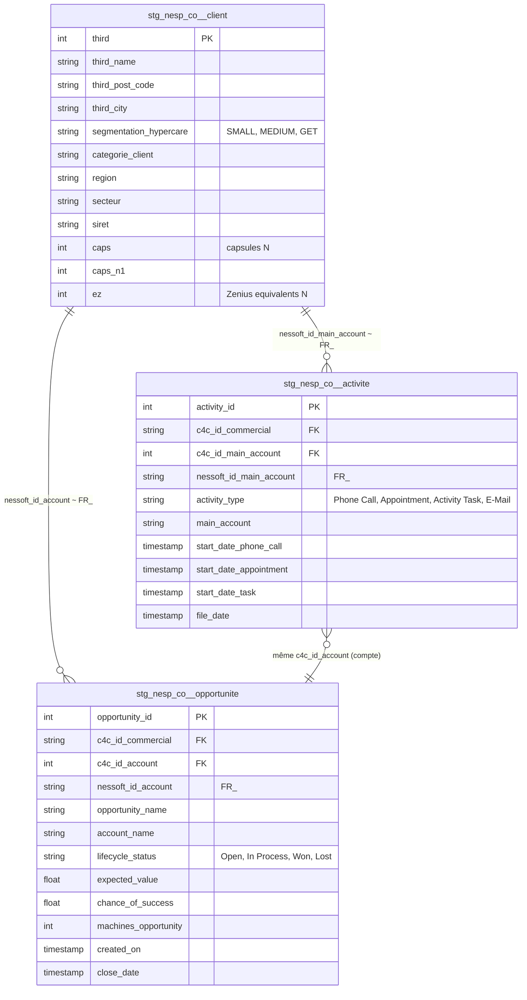

# Architecture — Nespresso Commerce (`nesp_co`)

> Dernière mise à jour : 2026-05-24

---

## Vue d'ensemble

`nesp_co` regroupe les données **commerciales Nespresso** consommées par EVS
Professionnelle France pour le pilotage de l'activité de vente :
- **Activités commerciales** des commerciaux EVS sur le CRM Nespresso C4C
  (appels téléphoniques, rendez-vous, tâches)
- **Opportunités** de vente (pipeline commercial)
- **Base clients** Nespresso côté EVS (référentiel `third`)

À la différence des sources API/ERP, **les trois tables proviennent de fichiers
Excel/CSV** déposés sur SFTP, avec deux pipelines distincts (cf.
`infra/workflows.tf` et `workflows/pipeline-nesp-co.yaml` /
`workflows/pipeline-sftp-nesp-client.yaml`) :

| Table | Pipeline Cloud Workflow | Déclenchement | Mode d'extraction |
|---|---|---|---|
| `nespresso_commerce_activite` | `pipeline-nesp-co` | **Quotidien à 08:00 Europe/Paris** (`cron 0 8 * * *`) | SFTP → GCS (Cloud Run `ingest-nespresso-commerce-gcs`) puis external table BigQuery |
| `nespresso_commerce_opportunite` | `pipeline-nesp-co` | **Quotidien à 08:00** (même pipeline) | SFTP → GCS puis external table |
| `nespresso_base_client` | `pipeline-sftp-nesp-client` | **Manuel** (déclenché à chaque livraison d'un fichier Excel "Base client - EVS" sur le SFTP) — pas de Cloud Scheduler | `tap-spreadsheets-anywhere` → BigQuery (`target-bigquery-upsert`) |

Les deux pipelines exécutent ensuite un `dbt build` avec
`DBT_SOURCE_SELECTOR=source:nesp_co` + `DBT_TAG_SELECTOR=tag:nesp_co`.

> Source historiquement **WIP** (cf. memory) — l'export reste artisanal, les
> colonnes Excel sans en-tête se traduisent par des champs `unnamed_*` au
> niveau brut.

---

## Flux de données

```
┌──────────────────────┐   SFTP / GCS       ┌─────────────────────────────┐
│  Nespresso C4C       │ ─────────────────► │  GCS bucket                 │
│  (CRM)               │   CSV hebdo        │  *.csv (activite, opp)      │
└──────────────────────┘                    └──────────┬──────────────────┘
                                                       │
┌──────────────────────┐   SFTP EVS         ┌─────────────────────────────┐
│  Base clients EVS    │ ─────────────────► │  Singer tap (Meltano)       │
│  (référentiel third) │                    │                             │
└──────────────────────┘                    └──────────┬──────────────────┘
                                                       │
                                                       ▼
                                       ┌──────────────────────────────────┐
                                       │  prod_raw                        │
                                       │  nespresso_commerce_activite     │
                                       │  nespresso_commerce_opportunite  │
                                       │  nespresso_base_client           │
                                       └──────────┬───────────────────────┘
                                                  │ dbt staging
                                                  ▼
                                       ┌──────────────────────────────────┐
                                       │  prod_staging                    │
                                       │  stg_nesp_co__activite           │
                                       │  stg_nesp_co__opportunite        │
                                       │  stg_nesp_co__client             │
                                       └──────────┬───────────────────────┘
                                                  │ dbt intermediate
                                                  ▼
                                       ┌──────────────────────────────────┐
                                       │  prod_intermediate               │
                                       │  int_nesp_co__activites          │
                                       │  int_nesp_co__opportunites       │
                                       │  int_nesp_co__clients_enrichis   │
                                       └──────────┬───────────────────────┘
                                                  │ dbt marts
                                                  ▼
                                       ┌──────────────────────────────────┐
                                       │  marts/commerce/                 │
                                       │  fct_commerce__machine_          │
                                       │  intervention                    │
                                       └──────────────────────────────────┘
```

**Fraîcheur** : tier *Standard* — warn 26h / error 48h sur `_sdc_extracted_at`.
Cohérent avec le rythme quotidien de `pipeline-nesp-co`. Le `base_client` étant
manuel, sa fraîcheur peut être plus dégradée — ne pas alerter sur lui comme
sur une source quotidienne.

---

## Modèle de données

### Diagramme des relations



---

## Rôle de chaque table

### Volumétrie (mai 2026)

| Modèle staging | Lignes | PK | Plage `file_date` |
|---|---|---|---|
| `stg_nesp_co__activite` | 135 294 | `activity_id` (unique) | 2025-09-17 → 2026-05-22 |
| `stg_nesp_co__opportunite` | 13 102 | `opportunity_id` (unique) | 2025-10-31 → 2026-05-22 |
| `stg_nesp_co__client` | 21 262 | `third` (unique) | — (full refresh) |

### `stg_nesp_co__activite`

Activités CRM des commerciaux. **Une ligne = une activité** (un appel, un RDV,
une tâche). 4 types observés :

| `activity_type` | Lignes | Champ description / date dédiés |
|---|---|---|
| `Phone Call` | 110 284 (81 %) | `phone_call`, `start_date_phone_call`, `created_by_phone_call` |
| `Appointment` | 23 063 (17 %) | `appointment`, `start_date_appointment`, `created_by_appointment` |
| `Activity Task` | 1 942 (1 %) | `start_date_task`, `employee_responsible` |
| `E-Mail` | 5 (anecdotique) | — |

> **Particularité :** les colonnes description/date sont **dédoublées par type**
> (phone_call vs. appointment) dans la source Excel. L'intermediate
> `int_nesp_co__activites` les unifie en `act_nom` / `act_date_debut` /
> `act_cree_par` via un `case ... when activity_type = ...`.

### `stg_nesp_co__opportunite`

Pipeline commercial. Une ligne = une opportunité avec KPI (valeur attendue,
chance de succès, nombre de machines, équivalent Zenius). Statuts possibles :
`Open`, `In Process`, `Won`, `Lost`.

### `stg_nesp_co__client`

Référentiel client EVS (table `third`). Pas une source Nespresso C4C mais le
**fichier interne EVS** qui fait le pont. Contient :
- Identité : nom, adresse, code postal, ville, SIRET
- Segmentation : `segmentation_hypercare` (SMALL/MEDIUM/GET), `categorie_client`,
  `region`, `secteur`
- KPI capsules : `caps`, `caps_n1`, `caps_n_ytd`, `caps_b2b`, `caps_b2c`
- KPI machines : `ez` (Zenius equivalents), `ez_n1`

---

## Jointures clés

### Cas 1 — Joindre une activité ou opportunité à un client EVS (`third`)

Le pont entre C4C (Nespresso) et `third` (EVS) passe par la colonne
`nessoft_id_main_account` (activités) ou `nessoft_id_account` (opportunités),
qui contient le format **`FR_<third>`**. Le `third` est à extraire par regex.

```sql
select
    a.act_id,
    a.act_nom,
    c.third_name,
    c.region
from {{ ref('int_nesp_co__activites') }} a
left join {{ ref('stg_nesp_co__client') }} c
    on c.third = safe_cast(regexp_extract(a.act_id_nessoft, r'FR_(\d+)') as int64)
```

### Cas 2 — Récupérer le `c4c_id` d'un client à partir du `third`

Le `stg_nesp_co__client` ne porte **pas** de `c4c_id`. L'intermediate
`int_nesp_co__clients_enrichis` le déduit en remontant via les opportunités
**et** les activités (union + dernière date) :

```sql
-- déjà packagé dans int_nesp_co__clients_enrichis : third → third_c4c_id
select
    third,
    third_name,
    third_c4c_id   -- déduit, NULL si aucune opp ni activité connue
from {{ ref('int_nesp_co__clients_enrichis') }}
```

**Taux de match** : ~64 % des clients ont un `c4c_id` déduit (13 539 / 21 262).
Le reste = clients sans aucune activité ni opportunité enregistrée côté C4C.

### Cas 3 — Opportunités gagnées avec contexte client

```sql
select
    o.opp_id,
    o.opp_nom,
    o.opp_date_cloture,
    o.opp_ns_attendu,
    o.opp_nb_opport     as machines_opp,
    c.third_name,
    c.region,
    c.segmentation_hypercare
from {{ ref('int_nesp_co__opportunites') }} o
left join {{ ref('stg_nesp_co__client') }} c
    on c.third = safe_cast(regexp_extract(o.opp_id_compte, r'FR_(\d+)') as int64)
where o.opp_statut = 'Gagné'
```

---

## Points d'attention

### Sentinel `'#'` = vide
La source Nespresso utilise la chaîne `'#'` pour les valeurs manquantes
(et non `NULL` ni `''`). **Toutes** les colonnes du staging passent par
`nullif(<col>, '#')` avant cast. Si tu ajoutes une colonne, **ne pas oublier
le `nullif`** sinon les `'#'` cassent le cast `int64` / `timestamp`.

### Colonnes `unnamed_*` dans la source brute
L'export Excel Nespresso produit des colonnes sans en-tête, ingérées avec des
noms générés (`unnamed_1`, `unnamed_5`, `unnamed_12`, `unnamed_22` côté
activité ; `unnamed_2`, `unnamed_4`, `unnamed_6`, `unnamed_8`, `unnamed_11`,
`unnamed_13` côté opportunité). Le staging les **renomme proprement** :

| Brut | Staging | Sens |
|---|---|---|
| `activite.unnamed_1` | `c4c_id_commercial` | ID C4C du commercial |
| `activite.unnamed_12` | `c4c_id_main_account` | ID C4C du compte client |
| `activite.unnamed_22` | `c4c_id_campaign` | ID C4C de la campagne |
| `opportunite.unnamed_2` | `c4c_id_commercial` | ID C4C du commercial |
| `opportunite.unnamed_13` | `c4c_id_account` | ID C4C du compte |
| `opportunite.unnamed_8` | `c4c_id_campaign` | ID C4C de la campagne |

Si un export futur change l'ordre des colonnes Excel, les `unnamed_*` se
décaleront silencieusement — surveiller via les tests `not_null` sur les ID
critiques.

### Déduplication par PK avec `extracted_at desc`
Activités et opportunités sont **rejouées intégralement** à chaque export
(snapshot full). Pour ne garder que la dernière version d'une ligne, le
staging applique :
```sql
qualify row_number() over (
    partition by activity_id   -- ou opportunity_id
    order by extracted_at desc
) = 1
```
Une opportunité dont le statut bascule `Open → Won` n'apparaîtra donc qu'une
seule fois, dans son **dernier état connu**. L'historique des transitions
est perdu — si besoin de retracer, créer un snapshot dbt sur le staging.

### Ligne « Result » dans les opportunités
Le CSV brut contient des lignes de total avec `opportunity = 'Result'`. Le
staging les filtre explicitement (`where opportunity != 'Result' or
opportunity is null`).

### Régression colonne `_caps_n_ytd` (préfixe `_` parasite)
La colonne CSV source `caps_n_ytd` arrive avec un underscore parasite
(`_caps_n_ytd`) dans `stg_nesp_co__client`. Le staging la renomme correctement
en `caps_n_ytd`. Si l'export change, surveiller un cast qui échoue.

### `int_nesp_co__clients_enrichis` — déduction `c4c_id` par UNION
Pour récupérer le `c4c_id` d'un client EVS (qui n'existe pas nativement dans
`stg_nesp_co__client`), l'intermediate fait :
1. UNION ALL des `(third, c4c_id, reference_date)` issus de
   `int_nesp_co__opportunites` et `int_nesp_co__activites`
2. ROW_NUMBER sur `third` ordonné par `reference_date desc nulls last`
3. Garde uniquement le `c4c_id` le plus récent

**Conséquence** : si un client a plusieurs `c4c_id` historiquement (cas rare —
changement de compte), seul le dernier connu est exposé. **64 % de match**
seulement (cf. § Cas 2) — les 36 % sans match sont des clients EVS sans
activité ni opportunité Nespresso enregistrée.

### Traduction EN → FR dans les intermediates
Les intermediates (`int_nesp_co__activites`, `int_nesp_co__opportunites`)
traduisent les libellés depuis l'anglais (`Phone Call` → `Appel téléphonique`,
`Won` → `Gagné`, `Customer` → `Client`, etc.) via des `case when`. Si une
nouvelle valeur apparaît côté source, elle remonte telle quelle en anglais —
ajouter le `when` correspondant.

### `chance_of_success` arrive en pourcentage texte
Format `"75%"` ou `"75,5%"` dans le CSV. Staging :
`cast(replace(replace(trim(...), '%', ''), ',', '.') as float64)`. Puis
l'intermediate divise par 100 (`opp_probabilite = chance_of_success / 100`)
pour exposer un ratio 0-1.

---

## Couche intermediate

3 modèles, tous matérialisés en `table`.

| Modèle | Rôle |
|---|---|
| `int_nesp_co__activites` | Unification phone_call / appointment / task → `act_nom`, `act_date_debut`, `act_cree_par`. Traduction EN→FR des types, rôles, statuts, catégories. Calcule `act_semaine_creation` au format `WW.YYYY`. Filtre les lignes vides (toutes les clés à NULL). |
| `int_nesp_co__opportunites` | Renommage `opportunity_* → opp_*`, traduction EN→FR des statuts/rôles, normalisation `chance_of_success` (% → ratio). Préserve tous les KPI (NS attendu, machines, EZ). |
| `int_nesp_co__clients_enrichis` | Joint `stg_nesp_co__client` avec le `c4c_id` déduit (UNION opportunités + activités, dernière date). Recompose `third_groupe` selon la règle métier (`%FID%` → région ; sinon `RS <categorie>`). |

---

## Marts consommateurs

| Mart | Famille | Rôle |
|---|---|---|
| `fct_commerce__machine_intervention` | `marts/commerce/` | Croisement opportunités Nespresso × interventions terrain (côté `nesp_tech`). Mart pivot du domaine commerce. |

Pas de dimension dédiée `dim_commerce__client` aujourd'hui — la BU `commerce`
est encore à constituer (cf. memory : refacto by BU, commerce restant). Les
modèles `int_nesp_co__*` jouent un rôle de dim/fact provisoire en attendant.
