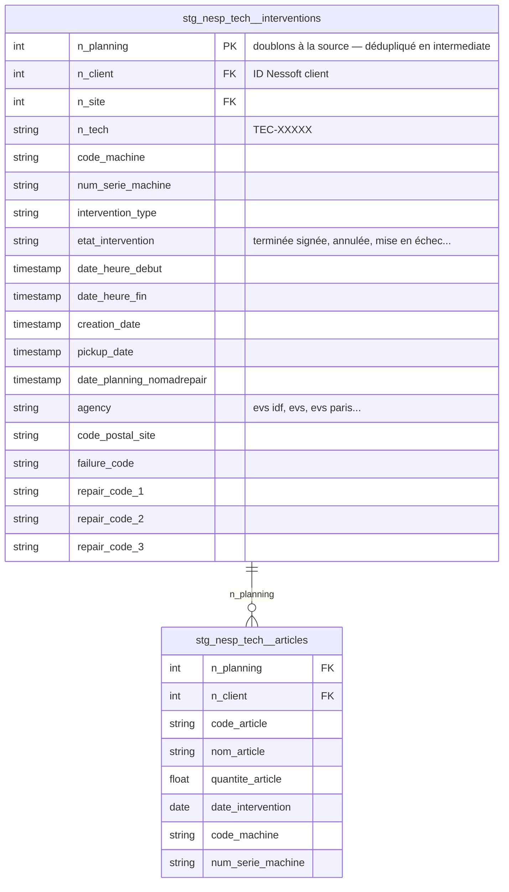

# Architecture — Nespresso Technique (`nesp_tech`)

> Dernière mise à jour : 2026-05-24

---

## Vue d'ensemble

`nesp_tech` expose les **interventions techniques Nespresso** réalisées par
les techniciens EVS et tracées dans **Nomad Repair** (API Arbiter). Le
périmètre couvre maintenance, réparation, mise en service de machines
Nespresso B2B chez les clients finaux, avec les articles (pièces / consommables)
consommés sur chaque intervention.

Données clés :
- **Interventions** (`nespresso_technique_interventions`) — table de fait
  principale : 1 ligne = 1 intervention (`n_planning`), avec dates, statut,
  technicien, machine, agence, codes panne / réparation
- **Articles** (`nespresso_technique_articles`) — détail des pièces et
  consommables utilisés : 1 ligne = 1 article sur 1 intervention

> Source ingérée par un **Cloud Run dédié** (`ingest-nesp-tech`) qui appelle
> l'API Arbiter Nomad Repair et dépose un fichier Excel sur GCS, lu ensuite
> via external table BigQuery.

---

## Flux de données

```
┌──────────────────────┐  Cloud Run dédié    ┌────────────────────────────┐
│  API Arbiter         │ ──────────────────► │  GCS bucket                │
│  (Nomad Repair)      │  ingest-nesp-tech   │  *.xlsx                    │
└──────────────────────┘                     └──────────┬─────────────────┘
                                                        │ external table
                                                        ▼
                                       ┌──────────────────────────────────┐
                                       │  prod_raw                        │
                                       │  nespresso_technique_            │
                                       │  interventions / _articles       │
                                       └──────────┬───────────────────────┘
                                                  │ dbt staging
                                                  ▼
                                       ┌──────────────────────────────────┐
                                       │  prod_staging                    │
                                       │  stg_nesp_tech__interventions    │
                                       │  stg_nesp_tech__articles         │
                                       └──────────┬───────────────────────┘
                                                  │ dbt intermediate
                                                  ▼
                                       ┌──────────────────────────────────┐
                                       │  prod_intermediate               │
                                       │  int_nesp_tech__interventions_   │
                                       │      dedup / articles_dedup      │
                                       │  int_nesp_tech__delais_          │
                                       │      interventions               │
                                       │  int_nesp_tech__facturation_     │
                                       │      interventions               │
                                       └──────────┬───────────────────────┘
                                                  │ dbt marts
                                                  ▼
                                       ┌──────────────────────────────────┐
                                       │  marts/technique/                │
                                       │  fct_technique__intervention     │
                                       │  fct_technique__piece_detachee_  │
                                       │      pricing_nespresso           │
                                       │  fct_technique__alerting_        │
                                       │      consommation_aguila         │
                                       │  marts/commerce/                 │
                                       │  fct_commerce__machine_          │
                                       │      intervention                │
                                       └──────────────────────────────────┘
```

### Orchestration (vérifié sur `infra/workflows.tf` + `workflows/pipeline-nesp-tech.yaml`)

| Pipeline | Cron | Effet |
|---|---|---|
| `pipeline-nesp-tech` | **`30 7 * * 1`** — lundi 07:30 Europe/Paris | EL (`ingest-nesp-tech` → GCS) puis `dbt build tag:nesp_tech` puis `dbt build tag:technique tag:commerce` (recompute des marts aval) |
| `export-nesp-tech-stock-yuman` | `0 10 * * 1` — lundi 10:00 Europe/Paris | Cloud Run dédié qui requête BigQuery, transforme et **uploade un CSV des mouvements de stock vers le SFTP Yuman** (export sortant, T+2h30 après l'extract) |

> **⚠️ Drift documentaire à corriger** : le commentaire d'en-tête de
> `workflows/pipeline-nesp-tech.yaml` indique *"Schedule: every day at 07:30,
> cron: 30 7 * * *"*. Le **Cloud Scheduler réel** (Terraform) est
> `30 7 * * 1` — **lundi uniquement**, pas tous les jours. La doc
> `docs/pipeline-schedule.md` documente bien l'hebdomadaire ; seul le YAML
> est désaligné.

**Fraîcheur source** : aucune config `loaded_at_field` / `freshness` dans
`_nesp_tech__sources.yml` aujourd'hui — `dbt source freshness` ne couvre
donc **pas** cette source. À aligner sur le tier *Standard* (26h / 48h) si
suivi voulu, en tenant compte du rythme hebdomadaire (warn 8j / error 14j
plus réaliste).

---

## Modèle de données

### Diagramme des relations



Deux tables, **liées par `n_planning`**. Pas de référentiel séparé technicien /
machine / client côté `nesp_tech` — les libellés sont dénormalisés dans
chaque ligne (nom technicien, raison sociale client, nom machine, etc.).

---

## Rôle de chaque table

### Volumétrie (mai 2026)

| Modèle | Lignes | `n_planning` distincts | Plage temporelle |
|---|---|---|---|
| `stg_nesp_tech__interventions` | 81 589 | **81 500** (99,89 % uniques) | 2024-01-02 → 2026-05-22 (`date_heure_fin`) |
| `stg_nesp_tech__articles` | 161 793 | 64 045 | 2023-11-29 → 2026-05-21 (`date_intervention`) |

**Couverture** :
- 64 045 / 81 500 interventions ont au moins un article consommé (**78,6 %**)
- **0 article orphelin** (tout `n_planning` côté articles existe côté interventions)
- Médiane = 1 article / intervention, P75 = 2, max = 18

### Répartition des statuts (`etat_intervention`)

| Statut | Lignes | % |
|---|---|---|
| `terminée signée` | 67 463 | 82,7 % |
| `annulée` | 11 278 | 13,8 % |
| `mise en échec` | 2 683 | 3,3 % |
| `signature différée` | 137 | 0,2 % |
| `terminée non signée` | 28 | 0,03 % |

> Les marts retiennent généralement `('terminée signée', 'signature différée')`
> — voir `int_nesp_tech__delais_interventions`. La facturation inclut aussi
> `mise en échec` — voir `int_nesp_tech__facturation_interventions`.

---

## Jointures clés

### Cas 1 — Intervention + articles consommés

```sql
select
    i.n_planning,
    i.date_heure_fin,
    i.etat_intervention,
    i.code_machine,
    i.nom_machine,
    i.agency,
    a.code_article,
    a.nom_article,
    a.quantite_article
from {{ ref('int_nesp_tech__interventions_dedup') }} i
left join {{ ref('int_nesp_tech__articles_dedup') }}  a
    on a.n_planning = i.n_planning
where i.etat_intervention in ('terminée signée', 'signature différée')
```

### Cas 2 — Filtrer les interventions facturables IDF (pattern delais)

```sql
-- déjà packagé dans int_nesp_tech__delais_interventions
select *
from {{ ref('int_nesp_tech__interventions_dedup') }}
where
    etat_intervention in ('terminée signée', 'signature différée')
    and agency in ('evs idf', 'evs', 'evs paris', 'evs paris 2')
```

### Cas 3 — Détection mini-prev (présence article `miniprev`)

```sql
select
    intv.n_planning,
    (art.code_article is not null) as mini_prev_bool
from {{ ref('int_nesp_tech__interventions_dedup') }} as intv
left join {{ ref('int_nesp_tech__articles_dedup') }}   as art
    on intv.n_planning = art.n_planning
   and art.code_article = 'miniprev'
```

---

## Points d'attention

### Source Excel → sentinels pandas `'nan'`, `'nat'`, `'01/01/0001'`
Le Cloud Run d'ingestion sérialise un DataFrame pandas en Excel : les valeurs
manquantes arrivent sous forme de chaînes **`'nan'`** (texte), **`'nat'`**
(timestamps), ou **`'01/01/0001'`** (dates par défaut). Toutes les colonnes
du staging filtrent ces trois sentinels. **Toujours utiliser le staging**,
jamais la source brute.

### `n_planning` n'est pas strictement unique à la source
La description YAML source l'indique explicitement : *"Identifiant de
l'intervention (peut être en doublons à la source)"*. Observé en prod :
81 589 lignes pour 81 500 `n_planning` distincts (89 doublons). Le staging
déduplique par `(n_planning, etat_intervention, date_heure_fin)` ordonné par
`extracted_at desc`. L'intermediate `int_nesp_tech__interventions_dedup`
re-déduplique par `n_planning` seul. **En aval, partir des intermediates,
jamais du staging directement.**

### Tout est `lower(trim(...))` en staging
Les libellés textuels (statut, agence, type, ville, etc.) sont passés en
minuscules et trim côté staging. **Conséquence pratique** : tout filtre
descendant doit utiliser la casse minuscule (`'terminée signée'`,
`'evs idf'`, etc.). C'est volontaire — uniformise la casse hétérogène venant
de Nomad Repair.

### `code_postal_site` — re-padding du 0 manquant
Excel/pandas stocke les codes postaux comme nombres et coupe le `0` initial
(`75001` → `75001` OK, mais `01000` → `1000`). Le staging détecte les codes
à 4 chiffres et préfixe un `0` :
```sql
case when regexp_contains(<col>, r'^\d{4}$') then concat('0', <col>) else <col> end
```
Préfère utiliser cette colonne en aval plutôt que la source brute. Même
nettoyage `.0` parasite (artefact float pandas).

### Hiérarchie de dédoublonnage `(stg → int dedup → marts)`
Trois niveaux successifs :
1. **`stg_nesp_tech__interventions`** : dédup `(n_planning, etat_intervention, date_heure_fin)` → conserve les variantes d'état pour audit
2. **`int_nesp_tech__interventions_dedup`** : dédup `n_planning` → 1 ligne / intervention, dernier état connu (par `date_heure_fin desc, extracted_at desc`)
3. **Marts** : partent de `int_*_dedup`, jamais du staging

Idem côté articles : staging garde la granularité brute, `int_nesp_tech__articles_dedup` déduplique par `(n_planning, code_article)`.

### `pickup_date` — format inconsistant
Deux formats observés à la source : timestamp ISO standard, ou `dd/mm/yyyy hh:mm`
avec parfois un siècle erroné (`00xx` au lieu de `20xx`). Le staging tente
d'abord un `safe_cast(... as timestamp)`, puis fallback sur
`safe.parse_timestamp('%d/%m/%Y %H:%M', regexp_replace(..., '00xx', '20xx'))`.
Si ce traitement échoue, la valeur passe en NULL — surveiller via
`countif(pickup_date is null)`.

### Pas de freshness configurée
`_nesp_tech__sources.yml` n'a aucune section `freshness` / `loaded_at_field`
à ce jour. `dbt source freshness` ignore la source. Si suivi voulu, ajouter
un tier *Standard adapté* (rythme hebdomadaire) : warn 8j / error 14j sur
`extracted_at`. Cf. memory project tier (actuel = Standard 26h/48h, à
réaligner).

### Pipeline lance aussi les marts aval directement
À la fin de `pipeline-nesp-tech`, en plus de `dbt build tag:nesp_tech`, le
workflow exécute **`dbt build tag:technique tag:commerce`** dans la foulée
(cf. step `run_dbt_technique_commerce`). Conséquence : les marts technique
et commerce sont rebuilt **chaque lundi vers 07:35-08:00**, en plus des
runs quotidiens `transform-technique-daily` (03:00, 08:00) et
`transform-commerce-daily` (08:30, 10:30). Voir
`docs/pipeline-schedule.md` pour la matrice complète.

### Export aller-retour vers Yuman (lundi 10:00)
Le Cloud Run `export-nesp-tech-stock-yuman` (lancé par
`export-nesp-tech-stock-yuman.yaml`, cron `0 10 * * 1`) requête BigQuery,
construit un CSV de mouvements de stock et l'**uploade sur le SFTP Yuman**.
Cela permet à Yuman d'intégrer les consommations nesp_tech dans son propre
stock. L'écart de 2h30 avec `pipeline-nesp-tech` (07:30) garantit que les
données BQ sont fraîches au moment de l'export.

---

## Couche intermediate

4 modèles, tous matérialisés en `table`.

| Modèle | Rôle |
|---|---|
| `int_nesp_tech__interventions_dedup` | Déduplication par `n_planning` (`date_heure_fin desc, extracted_at desc`). 1 ligne = 1 intervention dans son dernier état connu. **Point d'entrée principal** pour les marts technique / commerce. |
| `int_nesp_tech__articles_dedup` | Déduplication par `(n_planning, code_article)` ordonné par `extracted_at desc`. Évite les doublons d'articles dus aux re-livraisons de fichiers. |
| `int_nesp_tech__delais_interventions` | Calcule les délais effectifs (jours ouvrés, hors fériés via `ref_general__feries_metropole`) entre `creation_date`/`pickup_date` et `date_heure_debut`. Filtre IDF (`agency in ('evs idf', 'evs', 'evs paris', 'evs paris 2')`) + statuts `terminée signée` / `signature différée`. |
| `int_nesp_tech__facturation_interventions` | Construit la **clé de facturation** par typologie d'intervention, machine, présence d'article `miniprev`, et zone montagne (via département du code postal). Inclut aussi `mise en échec` pour la facturation forfait. |

> Les noms `dedup` reflètent la nature défensive : la source Excel rejoue
> régulièrement des lignes (full refresh par fichier). Les `dedup` neutralisent
> ce comportement.

---

## Marts consommateurs

### `marts/technique/`

| Modèle | Rôle |
|---|---|
| `fct_technique__intervention` | Fait pivot du domaine technique — interventions enrichies avec délais facturation, type machine, zone géographique. Partitionné `date_heure_fin`. |
| `fct_technique__piece_detachee_pricing_nespresso` | Valorisation des pièces détachées Nespresso consommées sur les interventions. |
| `fct_technique__alerting_consommation_aguila` | Alerting consommation machine Aguila (modèle spécifique) — détection de pics ou anomalies de consommation pièces. |

### `marts/commerce/`

| Modèle | Rôle |
|---|---|
| `fct_commerce__machine_intervention` | Croisement opportunités commerciales (`nesp_co`) × interventions techniques (`nesp_tech`) par machine. Mart pivot du domaine commerce. |

> Pas de dim dédiée Nespresso aujourd'hui — les libellés client / machine /
> technicien restent dénormalisés dans les facts (cohérent avec l'absence
> de référentiel séparé côté source).
