# Architecture — Oracle Neshu

> Dernière mise à jour : 2026-05-24

---

## Vue d'ensemble

Oracle Neshu est l'**ERP opérationnel principal** d'EVS Professionnelle France.
Il enregistre l'ensemble des opérations terrain autour des machines à café et
boissons déployées chez les clients : livraisons de consommables, passages
roadman (appro), interventions techniques, mouvements de stock, télémétrie,
pointages.

Ce pipeline extrait les données d'**Oracle (via Meltano tap-oracle)** vers
BigQuery `prod_raw` (mix full / incremental selon les tables) et les transforme
en dimensions et faits BI-ready pour Power BI.

Données clés exposées :
- **Tâches** (`evs_task`) — table de fait centrale, tous les événements opérationnels
- **Sociétés / Machines / Produits / Ressources** — référentiels métier
- **Contrats** — engagements commerciaux
- **Labels (EAV)** — attributs flexibles attachés aux entités (région, secteur,
  marque, gamme, modèle économique…)

> Pour le **contexte métier détaillé** (qu'est-ce qu'une tâche, un roadman, un
> passage appro, etc.), voir [`docs/onboarding_oracle_neshu.md`](../onboarding_oracle_neshu.md).
> Le présent document se concentre sur l'**architecture technique** : ERD,
> jointures, points d'attention.

---

## Flux de données

```
┌─────────────────┐    Meltano tap-oracle     ┌──────────────────────┐
│  Oracle Neshu   │ ─────────────────────►    │  prod_raw (BigQuery) │
│  (ERP)          │   mix full / incremental  │  oracle_neshu.evs_*  │
└─────────────────┘                           └──────────┬───────────┘
                                                         │ dbt staging
                                                         ▼
                                           ┌──────────────────────────┐
                                           │  staging                 │
                                           │  stg_oracle_neshu__*     │
                                           │  table (1 incremental :  │
                                           │  stg_oracle_neshu__task) │
                                           └──────────┬───────────────┘
                                                      │ dbt intermediate
                                                      ▼
                                           ┌──────────────────────────┐
                                           │  intermediate            │
                                           │  int_oracle_neshu__*     │
                                           │  (1 modèle / type tâche) │
                                           └──────────┬───────────────┘
                                                      │ dbt marts
                                                      ▼
                                           ┌──────────────────────────┐
                                           │  marts/neshu/            │
                                           │  dim_neshu__* /          │
                                           │  fct_neshu__*            │
                                           │  (+ marts/supply_chain/  │
                                           │   pour fct flux)         │
                                           └──────────────────────────┘
```

**Ce que fait chaque couche :**

| Couche | Rôle | Localisation |
|---|---|---|
| `prod_raw` | Données brutes Oracle, telles que reçues — aucune transformation | `evs-datastack-prod.prod_raw` |
| `staging` | Cast des IDs en `int64`, harmonisation timestamps, filtre `code_status_record = '1'` | `evs-datastack-prod.prod_staging` |
| `intermediate` | Découpage de `evs_task` par type de tâche, conversion d'unité, valorisation | `evs-datastack-prod.prod_intermediate` |
| `marts` | Dims pivotées (labels → colonnes), facts BI-ready | `evs-datastack-prod.prod_marts` |

**Fraîcheur (source freshness)** : tier *Critique* — warn 26h / error 36h sur
`_sdc_extracted_at`. Source par défaut pour toutes les tables `evs_*`.

**Snapshots SCD2** (gérés par Cloud Workflows, exclus du CI) :
- `snap_oracle_neshu__company` — historique nom / statut actif
- `snap_oracle_neshu__device` — historique modèle économique, transferts inter-sociétés
- `snap_oracle_neshu__valo_parc_machines` — valorisation mensuelle du parc

---

## Modèle de données

### Diagramme des relations (staging)

```mermaid
erDiagram

    stg_oracle_neshu__company {
        int idcompany PK
        int idcompany_type FK
        string company_name
        string company_code
    }

    stg_oracle_neshu__company_type {
        int idcompany_type PK
        string code
    }

    stg_oracle_neshu__company_has_location {
        int idcompany PK
        int idlocation PK
    }

    stg_oracle_neshu__location {
        int idlocation PK
        string address
        string city
        string postal_code
    }

    stg_oracle_neshu__contract {
        int idcontract PK
        int idcompany FK
        date contract_start_date
        date contract_end_date
    }

    stg_oracle_neshu__contact {
        int idcontact PK
        int idcompany FK
        string contact_name
    }

    stg_oracle_neshu__device {
        int iddevice PK
        int idcompany FK
        string device_serial_number
    }

    stg_oracle_neshu__product {
        int idproduct PK
        int idproduct_type FK
        string product_code
        string product_name
    }

    stg_oracle_neshu__product_type {
        int idproduct_type PK
        string code
    }

    stg_oracle_neshu__resources {
        int idresources PK
        int idresources_type FK
        int idcompany FK
        string code_gea
        string resource_name
    }

    stg_oracle_neshu__resources_type {
        int idresources_type PK
        string code "2=Personne, 3=Vehicule"
    }

    stg_oracle_neshu__task {
        int idtask PK
        int idtask_type FK
        int idtask_status FK
        int iddevice FK
        int idcompany_peer FK
        int idcontact FK
        int idlocation FK
        timestamp real_start_date
        timestamp real_end_date
    }

    stg_oracle_neshu__task_type {
        int idtask_type PK
        string code "3=Telemetrie, 13=Chargement, 101=Livraison, 131=Inter tech, 32=Appro, 162=Inventaire..."
    }

    stg_oracle_neshu__task_status {
        int idtask_status PK
        string code "FAIT, VALIDE, ANNULE..."
    }

    stg_oracle_neshu__task_has_product {
        int idtask_has_product PK
        int idtask FK
        int idproduct FK
        float real_quantity
        float unit_price
        float unit_coeff_multi
        float unit_coeff_div
    }

    stg_oracle_neshu__task_has_resources {
        int idtask_has_resources PK
        int idtask FK
        int idresources FK
    }

    stg_oracle_neshu__label_family {
        int idlabel_family PK
        string code "REGION, SECTEUR_DACTIVITE, ISACTIVE, MARQUE, GAMME..."
    }

    stg_oracle_neshu__label {
        int idlabel PK
        int idlabel_family FK
        string code "NORD, HORECA, yes/no, OR/ARGENT/BRONZE..."
    }

    stg_oracle_neshu__label_has_company {
        int idcompany FK
        int idlabel FK
    }

    stg_oracle_neshu__label_has_device {
        int iddevice FK
        int idlabel FK
    }

    stg_oracle_neshu__label_has_product {
        int idproduct FK
        int idlabel FK
    }

    stg_oracle_neshu__label_has_resources {
        int idresources FK
        int idlabel FK
    }

    stg_oracle_neshu__label_has_contract {
        int idcontract FK
        int idlabel FK
    }

    stg_oracle_neshu__label_has_task {
        int idtask FK
        int idlabel FK
    }

    %% Hiérarchie société / machine / contrat / contact / ressources
    stg_oracle_neshu__company ||--o{ stg_oracle_neshu__device : "idcompany"
    stg_oracle_neshu__company ||--o{ stg_oracle_neshu__contract : "idcompany"
    stg_oracle_neshu__company ||--o{ stg_oracle_neshu__contact : "idcompany"
    stg_oracle_neshu__company ||--o{ stg_oracle_neshu__resources : "idcompany"
    stg_oracle_neshu__company_type ||--o{ stg_oracle_neshu__company : "idcompany_type"
    stg_oracle_neshu__resources_type ||--o{ stg_oracle_neshu__resources : "idresources_type"
    stg_oracle_neshu__product_type ||--o{ stg_oracle_neshu__product : "idproduct_type"

    %% Localisation (relation n-n)
    stg_oracle_neshu__company ||--o{ stg_oracle_neshu__company_has_location : "idcompany"
    stg_oracle_neshu__location ||--o{ stg_oracle_neshu__company_has_location : "idlocation"

    %% Tâche au centre
    stg_oracle_neshu__task }o--|| stg_oracle_neshu__task_type : "idtask_type"
    stg_oracle_neshu__task }o--|| stg_oracle_neshu__task_status : "idtask_status"
    stg_oracle_neshu__task }o--|| stg_oracle_neshu__device : "iddevice"
    stg_oracle_neshu__task }o--|| stg_oracle_neshu__company : "idcompany_peer"
    stg_oracle_neshu__task }o--|| stg_oracle_neshu__contact : "idcontact"
    stg_oracle_neshu__task }o--|| stg_oracle_neshu__location : "idlocation"

    %% Tâche → produits / ressources (n-n)
    stg_oracle_neshu__task ||--o{ stg_oracle_neshu__task_has_product : "idtask"
    stg_oracle_neshu__product ||--o{ stg_oracle_neshu__task_has_product : "idproduct"
    stg_oracle_neshu__task ||--o{ stg_oracle_neshu__task_has_resources : "idtask"
    stg_oracle_neshu__resources ||--o{ stg_oracle_neshu__task_has_resources : "idresources"

    %% Système EAV de labels
    stg_oracle_neshu__label_family ||--o{ stg_oracle_neshu__label : "idlabel_family"
    stg_oracle_neshu__label ||--o{ stg_oracle_neshu__label_has_company : "idlabel"
    stg_oracle_neshu__label ||--o{ stg_oracle_neshu__label_has_device : "idlabel"
    stg_oracle_neshu__label ||--o{ stg_oracle_neshu__label_has_product : "idlabel"
    stg_oracle_neshu__label ||--o{ stg_oracle_neshu__label_has_resources : "idlabel"
    stg_oracle_neshu__label ||--o{ stg_oracle_neshu__label_has_contract : "idlabel"
    stg_oracle_neshu__label ||--o{ stg_oracle_neshu__label_has_task : "idlabel"
    stg_oracle_neshu__company ||--o{ stg_oracle_neshu__label_has_company : "idcompany"
    stg_oracle_neshu__device ||--o{ stg_oracle_neshu__label_has_device : "iddevice"
    stg_oracle_neshu__product ||--o{ stg_oracle_neshu__label_has_product : "idproduct"
    stg_oracle_neshu__resources ||--o{ stg_oracle_neshu__label_has_resources : "idresources"
    stg_oracle_neshu__contract ||--o{ stg_oracle_neshu__label_has_contract : "idcontract"
    stg_oracle_neshu__task ||--o{ stg_oracle_neshu__label_has_task : "idtask"
```



---

## Rôle de chaque table

### Entités principales

| Table staging | Ce qu'elle contient |
|---|---|
| `stg_oracle_neshu__company` | Sociétés (clients, fournisseurs, entités internes/dépôts). PK : `idcompany`. Typée via `idcompany_type` |
| `stg_oracle_neshu__device` | Machines déployées chez les clients. PK : `iddevice`. Rattachées à une société via `idcompany` |
| `stg_oracle_neshu__product` | Catalogue des articles consommables (capsules, thés, gobelets…). PK : `idproduct` |
| `stg_oracle_neshu__resources` | Ressources opérationnelles — **personnes (roadmen) et véhicules** dans la même table, distingués via `idresources_type` (2=personne, 3=véhicule) |
| `stg_oracle_neshu__contract` | Contrats commerciaux entre EVS et une société cliente |
| `stg_oracle_neshu__contact` | Contacts (personnes physiques) rattachés à une société |
| `stg_oracle_neshu__location` | Adresses physiques. Relation **n-n** avec society via `company_has_location` |

### Tables de fait (événements)

| Table staging | Ce qu'elle contient | Volume |
|---|---|---|
| `stg_oracle_neshu__task` | **Table centrale** — un événement = une ligne. Tous types confondus (livraison, appro, télémétrie, intervention…). Filtrée par `idtask_type` en intermediate. **Incrémentale (merge)**, partitionnée sur `real_start_date`, clusterée `idtask_type, idtask_status, idcompany_peer, iddevice` | ~très volumineux |
| `stg_oracle_neshu__task_has_product` | Produits déplacés/consommés sur une tâche (quantités + prix unitaire + coefficients d'unité). **Incrémentale (merge)** | très volumineux |
| `stg_oracle_neshu__task_has_resources` | Roadmen/véhicules affectés à une tâche (n-n) | volumineux |

### Référentiels (décodage IDs)

| Table staging | Ce qu'elle décode |
|---|---|
| `stg_oracle_neshu__task_type` | Type de tâche (`3`=Télémétrie, `13`=Chargement, `32`=Appro, `101`=Livraison, `121`=Réception, `131`=Inter technique, `132`=Commande interne, `161`=Livraison interne, `162`=Inventaire, `163`=Écart inventaire, `194`=Pointage, `11`=Invendus) |
| `stg_oracle_neshu__task_status` | Statut tâche (FAIT, VALIDE, ANNULE…) |
| `stg_oracle_neshu__resources_type` | 2=Personne, 3=Véhicule |
| `stg_oracle_neshu__company_type` | Catégorie de société |
| `stg_oracle_neshu__product_type` | Catégorie de produit |

### Système EAV de labels (7 tables)

| Table staging | Rôle |
|---|---|
| `stg_oracle_neshu__label_family` | Familles d'attributs (`REGION`, `SECTEUR_DACTIVITE`, `STATUT_CLIENT`, `ISACTIVE`, `MARQUE`, `GAMME`, `MODECOMA`, `FAMILLE`, `GROUPE`, `KA`…) |
| `stg_oracle_neshu__label` | Valeurs possibles (`NORD`, `HORECA`, `yes`, `OR`/`ARGENT`/`BRONZE`…). Rattachées à une famille via `idlabel_family` |
| `stg_oracle_neshu__label_has_company` | Liaison société ↔ label |
| `stg_oracle_neshu__label_has_device` | Liaison machine ↔ label |
| `stg_oracle_neshu__label_has_product` | Liaison produit ↔ label |
| `stg_oracle_neshu__label_has_resources` | Liaison ressource ↔ label |
| `stg_oracle_neshu__label_has_contract` | Liaison contrat ↔ label |
| `stg_oracle_neshu__label_has_task` | Liaison tâche ↔ label |

> **Ne jamais joindre les labels manuellement dans un mart.** Le pivot label →
> colonne est fait une fois pour toutes dans les `dim_neshu__*` (cf. § Pattern
> de pivot labels). Joindre directement la dim suffit.

---

## Jointures clés

### Pattern de pivot labels (EAV → colonnes)

C'est **le pattern central** des marts Neshu. Référence : `dim_neshu__company`,
`dim_neshu__device`, `dim_neshu__product`.

```sql
with entity_labels as (
    select
        c.*,
        l.code  as label_code,
        lf.code as label_family_code
    from {{ ref('stg_oracle_neshu__company') }} c
    left join {{ ref('stg_oracle_neshu__label_has_company') }} lhc
        on c.idcompany = lhc.idcompany
       and lhc.idlabel is not null
    left join {{ ref('stg_oracle_neshu__label') }} l
        on lhc.idlabel = l.idlabel
    left join {{ ref('stg_oracle_neshu__label_family') }} lf
        on l.idlabel_family = lf.idlabel_family
),
aggregated as (
    select
        idcompany,
        company_name,
        max(case when label_family_code = 'REGION'            then label_code end) as region,
        max(case when label_family_code = 'SECTEUR_DACTIVITE' then label_code end) as secteur,
        max(case when label_family_code = 'STATUT_CLIENT'     then label_code end) as statut_client,
        max(case when label_family_code = 'ISACTIVE'          then label_code end) as is_active_raw
    from entity_labels
    group by idcompany, company_name
)
select
    *,
    coalesce(lower(is_active_raw) = 'yes', false) as is_active
from aggregated
```

### Tâche enrichie (intermediate-style)

```sql
select
    t.idtask,
    t.real_start_date,
    tt.code  as task_type_code,
    ts.code  as task_status_code,
    c.company_name,
    d.device_serial_number,
    thp.idproduct,
    thp.real_quantity,
    thp.real_quantity * coalesce(thp.unit_coeff_multi, 1) / coalesce(thp.unit_coeff_div, 1) as quantite_ajustee,
    thp.real_quantity * thp.unit_price                                                       as valorisation
from {{ ref('stg_oracle_neshu__task') }}              t
left join {{ ref('stg_oracle_neshu__task_type') }}    tt  on tt.idtask_type   = t.idtask_type
left join {{ ref('stg_oracle_neshu__task_status') }}  ts  on ts.idtask_status = t.idtask_status
left join {{ ref('stg_oracle_neshu__company') }}      c   on c.idcompany      = t.idcompany_peer
left join {{ ref('stg_oracle_neshu__device') }}       d   on d.iddevice       = t.iddevice
left join {{ ref('stg_oracle_neshu__task_has_product') }} thp on thp.idtask   = t.idtask
where t.idtask_type = 101   -- ex : livraison
```

### Roadman d'une tâche

```sql
select
    t.idtask,
    r.idresources,
    r.resource_name,
    r.code_gea
from {{ ref('stg_oracle_neshu__task') }}                  t
join {{ ref('stg_oracle_neshu__task_has_resources') }}    thr on thr.idtask     = t.idtask
join {{ ref('stg_oracle_neshu__resources') }}             r   on r.idresources  = thr.idresources
where r.idresources_type = 2  -- 2 = personne (roadman) ; 3 = véhicule
```

---

## Points d'attention

### `evs_task` mélange tous les types — filtrer systématiquement sur `idtask_type`
Une livraison, un passage appro, une intervention technique, un inventaire et
un pointage cohabitent dans la même table. **Jamais d'analyse sans filtre
`idtask_type`.** Le filtre est appliqué une fois pour toutes dans la couche
intermediate (un modèle par type — `int_oracle_neshu__livraison_tasks`,
`__chargement_tasks`, `__telemetry_tasks`, etc.). En aval, partir toujours d'un
intermediate, pas de `stg_oracle_neshu__task` directement.

### `code_status_record = '1'` est appliqué en staging
Les tâches avec `code_status_record` ≠ `1` (= non validées / brouillon Oracle)
sont **filtrées dès le staging**. En aval, considérer que toutes les lignes
visibles sont des tâches validées. Pour réintégrer les non-validées (cas rare —
audit qualité), il faut relire la source brute.

### `stg_oracle_neshu__task` est incrémental — fenêtre de 7 jours
Seul modèle staging incrémental (volume trop important pour un full refresh).
Stratégie `merge` sur `idtask`, condition d'incrément :
`updated_at > max(updated_at) ou updated_at >= now() - 7 jours`. Cette fenêtre
de 7 jours rattrape les rares mises à jour rétroactives dans Oracle. Si un
backfill plus profond est nécessaire, lancer un `--full-refresh` sur le modèle.
`stg_oracle_neshu__task_has_product` suit le même pattern.

### Le système de labels (EAV) — ne jamais joindre directement dans un mart
Oracle Neshu utilise un modèle Entity-Attribute-Value pour les attributs
flexibles : pour connaître la région d'une société, il faut joindre 3 tables
(`label_family` → `label` → `label_has_company`). **Ce pivot est fait une fois
dans les dims** (`dim_neshu__company`, `dim_neshu__device`, `dim_neshu__product`,
`dim_neshu__resource`). Tout mart en aval doit joindre la **dim**, pas les
tables `label_*`. Pour ajouter un nouvel attribut basé sur un label, modifier
le bloc `max(case when label_family_code = ...)` de la dim correspondante.

### `resources` mélange personnes et véhicules
Le même table contient roadmen et camions, distingués par `idresources_type`
(2=personne, 3=véhicule). Pour analyser uniquement les roadmen ou uniquement
les véhicules, **filtrer explicitement**. La dim helper `dim_neshu__vehicule_roadman`
fournit déjà la jointure véhicule ↔ roadman (via le code GEA) si besoin.

### Coefficients d'unité — toujours travailler en `quantite_ajustee` dans les marts
Certains produits sont stockés en unité d'emballage (ex. « GOBELET RAME 50 » =
1 unité Neshu = 50 gobelets réels). La conversion se fait via :
```
quantite_ajustee = real_quantity * unit_coeff_multi / unit_coeff_div
```
Appliquée systématiquement dans les intermediate `__*_tasks`. Dans les marts,
ne jamais re-multiplier — la quantité exposée est déjà ajustée.

### Société : `idcompany_peer` côté tâche, pas `idcompany`
La FK société sur `evs_task` s'appelle `idcompany_peer` (et non `idcompany`).
Cela vient du fait qu'une tâche peut avoir deux sociétés (émettrice/destinataire,
pour les mouvements internes). Le « peer » est celui que l'on retient pour
l'analyse métier (le client final pour une livraison, le dépôt source pour une
réception, etc.).

### `_oracle_neshu__sources.yml` désactive la freshness sur les référentiels
Les tables référentielles stables (`evs_task_type`, `evs_task_status`,
`evs_resources_type`, `evs_company_type`, `evs_product_type`, `evs_label_family`)
ont leur freshness explicitement désactivée — elles peuvent ne pas être
ré-extraites pendant plusieurs jours sans que cela soit une anomalie.

---

## Couche intermediate

Un modèle intermediate par **type de tâche** (filtre `idtask_type`) +
deux modèles transverses non liés à `evs_task`. Tous matérialisés en `table`.

### Par type de tâche

| Modèle | `idtask_type` | Rôle métier |
|---|---|---|
| `int_oracle_neshu__telemetry_tasks` | 3 | Lecture compteur machine |
| `int_oracle_neshu__chargement_tasks` | 13 | Chargement de produits dans une machine sur site |
| `int_oracle_neshu__livraison_tasks` | 101 | Livraison consommables chez le client |
| `int_oracle_neshu__reception_tasks` | 121 | Réception stock fournisseur |
| `int_oracle_neshu__inter_techinique_tasks` | 131 | Maintenance / réparation / détartrage |
| `int_oracle_neshu__commande_interne_tasks` | 132 | Mouvement entre zones internes |
| `int_oracle_neshu__livraison_interne_tasks` | 161 | Mouvement entre entités internes |
| `int_oracle_neshu__inventaire_tasks` | 162 | Comptage de stock |
| `int_oracle_neshu__ecart_inventaire_tasks` | 163 | Enregistrement d'écart de stock |
| `int_oracle_neshu__pointage_tasks` | 194 | Pointage début/fin de journée roadman |
| `int_oracle_neshu__appro_tasks` | 32 | Passage roadman sur une machine |
| `int_oracle_neshu__invendus_tasks` | 11 | Redistribution d'invendus |

Chaque modèle applique le même pattern :
1. Filtre `stg_oracle_neshu__task` sur l'`idtask_type` concerné
2. Joint `stg_oracle_neshu__task_has_product` (produits + quantités + prix)
3. Joint optionnellement `stg_oracle_neshu__task_has_resources` (roadman/véhicule)
4. Applique la conversion `quantite_ajustee` (coefficients d'unité)
5. Calcule `valorisation = real_quantity * unit_price`

### Modèles transverses

| Modèle | Rôle |
|---|---|
| `int_oracle_neshu__valorisation_parc_machines` | Agrège #machines + valeur totale par modèle/groupe (alimente le snapshot mensuel) |
| `int_oracle_neshu__appro_machine_context` | Contexte machine pour les passages appro |
| `int_oracle_neshu__appro_tasks_enriched` | Vue enrichie des passages appro (chaînage entre passages, KPI durée…) |

---

## Marts consommateurs

Les modèles oracle_neshu alimentent principalement `marts/neshu/` et
`marts/supply_chain/` (post-refacto BU 2026-05).

### `marts/neshu/`

| Modèle | Type | Rôle |
|---|---|---|
| `dim_neshu__company` | dim | Sociétés avec région, secteur, statut client, KA, tranche collab, adresse — labels pivotés |
| `dim_neshu__device` | dim | Machines avec marque, gamme, catégorie, modèle économique, is_active |
| `dim_neshu__product` | dim | Produits avec marque, famille, groupe, type produit standardisé, is_active |
| `dim_neshu__contract` | dim | Contrats actifs par société + engagement nettoyé |
| `dim_neshu__resource` | dim | Roadmen + véhicules (avec code GEA, société, coût, dates) |
| `dim_neshu__vehicule_roadman` | dim helper | Mapping véhicule ↔ roadman pour analyse par véhicule |
| `fct_neshu__consommation` | fact | Consommation consolidée 3 sources (télémétrie / chargement / livraison). Partitionné `consumption_date` |
| `fct_neshu__appro` | fact | Passages appro détaillés + durée + classement journalier + heures de travail. Partitionné `task_start_date` |
| `fct_neshu__chargement_consommation` | fact | Comparaison chargement vs. télémétrie par machine/produit/fenêtre |
| `fct_neshu__chargement_quinzaine` | fact | Totaux chargement bi-hebdo par type produit / société |
| `fct_neshu__machine_appro_intervention` | fact | Croisement appro × intervention par machine (post-refacto) |
| `fct_neshu__maintenance_preventive` | fact | Maintenance préventive (s'appuie aussi sur yuman) |
| `fct_neshu__workorder_delai` | fact | Délais workorder (croise yuman + neshu) |

### `marts/supply_chain/`

- `fct_supply_chain__flux_neshu` — flux supply chain mensuel (stocks + réceptions + tous types de mouvements consolidés). Partitionné `mois_date`.

### Sources externes Cloud Run

- `fct_neshu__monitoring_passage_appro` — table écrite directement par un Cloud Run job, déclarée comme source dans `_neshu__marts_sources.yml`. Référencée via `source('marts_neshu_external', 'fct_neshu__monitoring_passage_appro')` — **ne pas wrapper dans un modèle dbt**.
