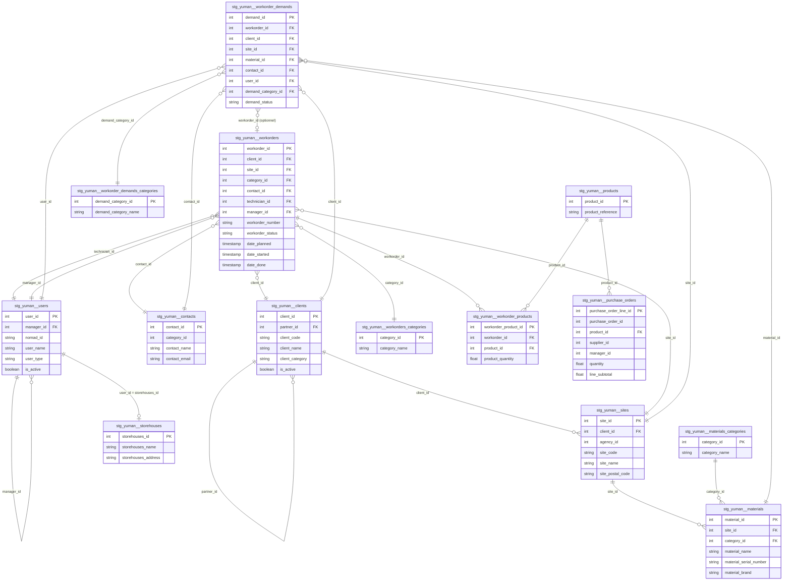

# Architecture — Yuman

> Dernière mise à jour : 2026-05-19

---

## Vue d'ensemble

Yuman est l'outil de gestion des interventions terrain (workorders) et des
demandes d'intervention pour les techniciens EVS. Ce pipeline extrait les
données de l'**API Yuman** (extraction quotidienne, full refresh via Meltano)
et les rend disponibles dans BigQuery pour la facturation, le pilotage du SAV
et le suivi des partenaires.

Données clés exposées :
- **Workorders** (interventions) — base de la facturation
- **Workorder demands** (demandes d'intervention)
- **Purchase orders** (commandes d'achat fournisseurs)
- Référentiels clients / sites / matériels / contacts / utilisateurs

---

## Flux de données

```
┌─────────────────┐    Meltano (Singer)   ┌──────────────────────┐
│   API Yuman     │ ──────────────────►   │  prod_raw (BigQuery) │
│                 │   full refresh / day  │  yuman_*             │
└─────────────────┘                       └──────────┬───────────┘
                                                     │ dbt staging
                                                     ▼
                                       ┌──────────────────────────┐
                                       │  staging (BigQuery)      │
                                       │  stg_yuman__*            │
                                       │  matérialisé en TABLE    │
                                       └──────────┬───────────────┘
                                                  │ dbt intermediate
                                                  ▼
                                       ┌──────────────────────────┐
                                       │  intermediate            │
                                       │  int_yuman__*            │
                                       └──────────┬───────────────┘
                                                  │ dbt marts
                                                  ▼
                                       ┌──────────────────────────┐
                                       │  marts                   │
                                       │  dim_yuman__* / fct_*    │
                                       │  + marts technique &     │
                                       │    commerce              │
                                       └──────────────────────────┘
```

**Ce que fait chaque couche :**

| Couche | Rôle | Localisation |
|---|---|---|
| `prod_raw` | Données brutes telles que reçues de l'API — aucune transformation | `evs-datastack-prod.prod_raw` |
| `staging` | Nettoyage, renommage des PKs, cast des types, extraction des champs custom JSON | `evs-datastack-prod.prod_staging` |
| `intermediate` | Vue unifiée demandes ↔ interventions + enrichissement référentiels | `evs-datastack-prod.prod_intermediate` |
| `marts` | Dimensions et faits BI-ready (modèle en étoile) | `evs-datastack-prod.prod_marts` |

**Fraîcheur (source freshness)** : tier *Standard* — warn 26h / error 48h sur
`_sdc_extracted_at`. Les tables référentielles stables (`products`,
`material_categories`, `workorder_categories`, `storehouses`) ont la freshness
désactivée.

---

## Modèle de données

### Diagramme des relations



---

## Rôle de chaque table

### Dimensions — les référentiels

| Table | Ce qu'elle contient | Lignes (~) |
|---|---|---|
| `stg_yuman__clients` | Clients EVS (entités contractuelles), avec catégorie EVS (OR / ARGENT / BRONZE) et nom du partenaire (self-join via `partner_id`) | 2 103 |
| `stg_yuman__sites` | Sites physiques rattachés à un client (un client peut avoir plusieurs sites) | 2 604 |
| `stg_yuman__materials` | Machines / équipements installés sur les sites | 9 449 |
| `stg_yuman__materials_categories` | Catégories de matériels | 206 |
| `stg_yuman__contacts` | Contacts (personnes physiques) — référentiel autonome, sans rattachement direct à un client ou un site (cf. point d'attention) | 1 794 |
| `stg_yuman__users` | Techniciens et managers internes EVS, avec rattachement Nomad (`nomad_id`) et hiérarchie (`manager_id`) | 94 |
| `stg_yuman__products` | Catalogue des produits / pièces détachées | 4 000 |
| `stg_yuman__workorders_categories` | Catégories d'intervention | 64 |
| `stg_yuman__workorder_demands_categories` | Catégories de demandes d'intervention | 57 |
| `stg_yuman__storehouses` | Entrepôts mobiles. `storehouses_id` correspond au `user_id` du technicien ou manager propriétaire (41/45). Exceptions : 4 ateliers physiques (Rungis/Lyon, Lyon, Strasbourg, Bordeaux) sans user associé | 45 |

### Facts — les événements

| Table | Ce qu'elle contient | Lignes (~) |
|---|---|---|
| `stg_yuman__workorders` | **Table centrale** — un workorder par ligne, avec ses dates clés (`date_planned`, `date_started`, `date_done`) et tous les champs custom EVS extraits du JSON `_embed_fields` (motif non-intervention, raison mise en pause, etc.) | 17 538 |
| `stg_yuman__workorder_demands` | Demandes d'intervention. Une demande peut être convertie ou non en workorder (`workorder_id` nullable) | 17 954 |
| `stg_yuman__workorder_products` | Produits / pièces consommés lors de chaque intervention. Une ligne = 1 produit utilisé sur 1 workorder. Issu du JSON `_embed_products` de `yuman_workorders` | 15 441 |
| `stg_yuman__purchase_orders` | Bons de commande **dépliés** — une ligne = 1 commande + 1 article (le JSON `lines` est unnested) | 7 172 |

---

## Jointures clés

### Cas d'usage typiques

**Workorder avec ses dimensions :**
```sql
select
    w.workorder_id,
    w.workorder_number,
    w.workorder_status,
    w.date_planned,
    w.date_done,
    cl.client_name,
    cl.partner_name,
    s.site_name,
    s.site_postal_code,
    wc.category_name  as workorder_category,
    tech.user_name    as technician_name
from stg_yuman__workorders            w
left join stg_yuman__clients              cl   on cl.client_id   = w.client_id
left join stg_yuman__sites                s    on s.site_id      = w.site_id
left join stg_yuman__workorders_categories wc  on wc.category_id = w.category_id
left join stg_yuman__users                tech on tech.user_id   = w.technician_id
```

**Demande d'intervention enrichie (déjà disponible en intermediate) :**
```sql
select *
from prod_intermediate.int_yuman__demands_workorders_enriched
where demand_status = 'Open'   -- valeurs possibles : Accepted, Rejected, Open
```

**Produits consommés sur une intervention :**
```sql
select
    w.workorder_number,
    wp.product_reference,         -- dénormalisé depuis le JSON dans workorder_products
    wp.product_designation,
    wp.product_quantity,
    p.product_code,               -- côté référentiel produits
    p.product_name
from stg_yuman__workorders         w
join stg_yuman__workorder_products wp on wp.workorder_id = w.workorder_id
left join stg_yuman__products      p  on p.product_id    = wp.product_id
where w.workorder_id = <id>
```

**Lignes d'une commande d'achat :**
```sql
select
    purchase_order_number,
    line_reference,
    line_description,
    quantity,
    unit_price,
    line_subtotal
from stg_yuman__purchase_orders
where purchase_order_id = <id>
order by purchase_order_line_id
```

**Hiérarchie partenaire → client :**
```sql
select
    c.client_id,
    c.client_name,
    c.partner_id,
    c.partner_name      -- déjà résolu par self-join dans le staging
from stg_yuman__clients c
where c.partner_id is not null
```

---

## Points d'attention

### `stg_yuman__contacts` n'a ni `client_id` ni `site_id`
Contrairement à ce que suggère la source brute Yuman, ces colonnes ont été
**retirées du staging** (voir lignes commentées dans `_yuman__models.yml`).
Le seul moyen de relier un contact à un site / un client est de passer par
`workorders.contact_id` ou `workorder_demands.contact_id`. Ne pas chercher à
rejoindre `contacts.site_id` directement — la colonne n'existe pas.

### `stg_yuman__clients.partner_name` provient d'un self-join
Yuman représente la hiérarchie partenaire ↔ client par une self-référence
(`partner_id` pointe vers un autre `client_id` de la même table). Le staging
résout déjà cette jointure et expose `partner_name` directement. Inutile de la
recalculer en aval.

### `stg_yuman__workorder_demands.workorder_id` est nullable
Toutes les demandes ne deviennent pas des workorders (rejet, annulation, en
attente). Inversement, certains workorders n'ont pas de demande
correspondante (créés manuellement par un technicien). Pour cette raison, le
modèle intermediate `int_yuman__demands_workorders_enriched` utilise un
`FULL JOIN` entre demandes et workorders.

### Les champs custom EVS sont extraits du JSON `_embed_fields`
Yuman stocke les champs personnalisés dans un tableau JSON (`_embed_fields`)
sur les tables `workorders`, `clients`, `materials`, `users` et `sites`. Le
staging extrait les valeurs par `name` via `json_extract_array` +
`json_extract_scalar`. Exemples :
- `workorders` : `DATE DE CREATION`, `MOTIF DE NON INTERVENTION`,
  `RAISON MISE EN PAUSE`, `NECESSITE D'INTERVENIR`, etc.
- `clients` : `CATEGORIE CLIENT EVS` (OR / ARGENT / BRONZE)
- `materials` : `LOCALISATION`
- `sites` : `CODE POSTAL` (avec nettoyage `.0` final)
- `users` : `ID NOMAD`, `SECTEUR`, `INACTIF`

Pour ajouter un nouveau champ custom, modifier le staging correspondant —
**ne pas** chercher la valeur dans une colonne dédiée côté source.

### `stg_yuman__purchase_orders` et `stg_yuman__workorder_products` sont dépliés
Ces deux modèles staging "explosent" un JSON array de la source :
- `purchase_orders` : 1 ligne = 1 commande **+** 1 article (champ `lines`).
  Les champs entête de commande sont dupliqués sur chaque ligne. La PK est
  `purchase_order_line_id`, pas `purchase_order_id`.
- `workorder_products` : 1 ligne = 1 produit utilisé sur 1 workorder, issu
  de `_embed_products` dans `yuman_workorders`. Cela évite d'avoir à
  re-parser le JSON dans chaque mart consommateur.

### `storehouses_id` est identique au `user_id` du propriétaire
Un storehouse Yuman représente l'entrepôt mobile (stock embarqué) d'un
technicien ou d'un manager. La règle métier — non documentée par Yuman mais
vérifiée empiriquement — est que `storehouses_id = user_id`. Sur 45
storehouses : 38 matchent un technicien, 3 matchent un manager, et 4 sont des
**ateliers physiques** sans user associé :

| storehouses_id | Nom |
|---|---|
| 1891 | 06 - ATELIER RUNGIS DEPOT *(adresse Dardilly/69 — incohérence libellé)* |
| 311335 | 07 - ATELIER LYON DEPOT |
| 311336 | 09 - ATELIER STRASBOURG DEPOT |
| 311337 | 08 - ATELIER BORDEAUX DEPOT |

Un test `relationships` (severity = `warn`) entre `stg_yuman__storehouses.storehouses_id`
et `stg_yuman__users.user_id` est en place dans `_yuman__models.yml` pour
détecter toute dérive future (sortie de plus de 4 orphelins → alerte).

### Le rattachement technicien → agence passe par un mapping nom/prénom
Yuman ne porte pas l'agence du technicien. Le mapping est fourni par un seed
(`ref_yuman__tech_agence`) et la jointure se fait sur le nom complet du
technicien (`workorder_technician_name`) après normalisation (uppercase, trim,
suppression du préfixe `[INACTIF]`). C'est fragile : tout changement
d'orthographe d'un nom côté Yuman casse la jointure. À surveiller lors d'un
audit qualité.

---

## Couche intermediate

Yuman dispose actuellement d'**un seul modèle intermediate** :
`int_yuman__demands_workorders_enriched`. Il consolide en une vue large
(« fat row ») la jointure demande ↔ workorder + tous les référentiels
associés, et sert de base aux marts technique / commerce.

### Diagramme de flux

```mermaid
flowchart TB
    subgraph staging["staging (couche existante)"]
        stg_demands[stg_yuman__workorder_demands]
        stg_demands_cat[stg_yuman__workorder_demands_categories]
        stg_wo[stg_yuman__workorders]
        stg_clients[stg_yuman__clients]
        stg_sites[stg_yuman__sites]
        stg_contacts[stg_yuman__contacts]
        stg_materials[stg_yuman__materials]
        stg_mat_cat[stg_yuman__materials_categories]
        stg_users[stg_yuman__users]
        seed_tech[(ref_yuman__tech_agence)]
    end

    subgraph intermediate["intermediate"]
        int_enriched[int_yuman__demands_workorders_enriched<br/>1 ligne / demande ⨝ workorder]
    end

    stg_demands --> int_enriched
    stg_demands_cat --> int_enriched
    stg_wo --> int_enriched
    stg_clients --> int_enriched
    stg_sites --> int_enriched
    stg_contacts --> int_enriched
    stg_materials --> int_enriched
    stg_mat_cat --> int_enriched
    stg_users --> int_enriched
    seed_tech --> int_enriched

    classDef seed fill:#fff3cd,stroke:#856404
    classDef int fill:#d1ecf1,stroke:#0c5460,font-weight:bold
    class seed_tech seed
    class int_enriched int
```



### Modèle intermediate

| Modèle | Grain | Source | Rôle |
|---|---|---|---|
| `int_yuman__demands_workorders_enriched` | 1 ligne par demande **FULL JOIN** workorder | demands + workorders + clients + sites + contacts + materials + materials_categories + users + seed tech_agence | Vue large servant de fondation aux marts Yuman / technique / commerce. Partition sur `demand_created_at`. |

### Choix de modélisation

- **`FULL JOIN` plutôt que `LEFT JOIN`** : car un workorder peut exister
  sans demande (créé directement par un technicien) et une demande peut
  exister sans workorder (rejet / annulation / en attente). Conserver les
  deux populations est nécessaire pour les marts SAV.
- **Mapping technicien → agence par nom** : implémenté ici pour éviter de
  le dupliquer dans chaque mart consommateur. Cf. point d'attention.

---

## Marts consommateurs

Les modèles Yuman alimentent deux familles de marts :

| Dossier | Marts | Usage BI |
|---|---|---|
| `marts/yuman/` | `dim_yuman__clients`, `dim_yuman__sites`, `dim_yuman__materials`, `dim_yuman__materials_clients`, `dim_yuman__technicians`, `fct_yuman__suivi_partenaires`, `fct_yuman__workorder_delais_neshu`, `fct_yuman__workorder_pricing` | Pilotage partenaires, délais, pricing |
| `marts/technique/` | `fct_technique__interventions`, `fct_technique__neshu_maintenance_preventives` | Suivi opérationnel SAV (croisement avec Oracle Neshu) |

> Note : `marts/commerce/fct_commerce__machines_avec_interventions` ne
> consomme **pas** de données Yuman (il s'appuie sur `nesp_tech` et `nesp_co`).
