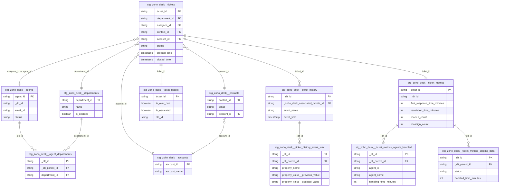

# Architecture — Zoho Desk

> Dernière mise à jour : 2026-05-06

---

## Vue d'ensemble

Zoho Desk est le logiciel de support client utilisé pour gérer les tickets entrants
(email, téléphone, chat, formulaire web). Ce pipeline extrait les données de l'API
Zoho Desk (EU region) et les rend disponibles dans BigQuery pour l'analyse.

---

## Flux de données

```
┌─────────────────┐     dlt (Python)     ┌──────────────────────┐
│   API Zoho Desk │ ──────────────────►  │  prod_raw (BigQuery)  │
│   EU region     │   extraction full    │  zoho_desk_*          │
└─────────────────┘   write_disposition  └──────────┬───────────┘
                        = merge/replace             │
                                                    │ dbt staging
                                                    ▼
                                       ┌──────────────────────────┐
                                       │  staging (BigQuery)       │
                                       │  stg_zoho_desk__*         │
                                       │  matérialisé en TABLE     │
                                       └──────────────────────────┘
```

**Ce que fait chaque couche :**

| Couche | Rôle | Localisation |
|---|---|---|
| `prod_raw` | Données brutes telles que reçues de l'API — aucune transformation | `evs-datastack-prod.prod_raw` |
| `staging` | Nettoyage, renommage des PKs, cast des types, documentation | `evs-datastack-prod.prod_staging` |
| `intermediate` | Modèles événementiels par propriété + agrégations SLA réutilisables | `evs-datastack-prod.prod_intermediate` |
| `marts` *(à venir)* | Métriques et dimensions BI-ready (modèle en étoile) | `evs-datastack-prod.prod_marts` |

---

## Modèle de données

### Diagramme des relations



---

## Rôle de chaque table

### Dimensions — les référentiels

| Table | Ce qu'elle contient | Lignes (~) |
|---|---|---|
| `stg_zoho_desk__accounts` | Entreprises clientes | 251 |
| `stg_zoho_desk__contacts` | Personnes physiques (clients) liées à un compte | 3 362 |
| `stg_zoho_desk__agents` | Membres de l'équipe support | 5 |
| `stg_zoho_desk__departments` | Groupes organisationnels (ex : Service Client, Facturation) | 4 |
| `stg_zoho_desk__agent_departments` | Table pont agent ↔ département (un agent peut appartenir à plusieurs départements) | 11 |

### Facts — les événements

| Table | Ce qu'elle contient | Lignes (~) |
|---|---|---|
| `stg_zoho_desk__tickets` | **Table centrale** — un ticket par ligne, avec tous ses attributs courants | 20 678 |
| `stg_zoho_desk__ticket_details` | Enrichissement 1:1 : flags SLA, champs custom (`cf_*`), résolution | 20 678 |
| `stg_zoho_desk__ticket_metrics` | Enrichissement 1:1 : durées SLA et compteurs (réponse, réouverture, réassignation) | 20 678 |
| `stg_zoho_desk__ticket_history` | Journal d'audit : un événement par ligne (création, changement de statut, etc.) | 259 677 |
| `stg_zoho_desk__ticket_history_event_info` | Détail de chaque événement : champ modifié, valeur avant, valeur après | 823 452 |
| `stg_zoho_desk__ticket_metrics_agents_handled` | Agents ayant traité chaque ticket avec leur temps de traitement individuel | 33 608 |
| `stg_zoho_desk__ticket_metrics_staging_data` | Temps passé par chaque ticket dans chaque statut Zoho ("staging" = étape de statut) | 46 663 |

---

## Jointures clés

### Cas d'usage typiques

**Ticket avec ses dimensions :**
```sql
select
    t.ticket_id,
    t.ticket_number,
    t.status,
    t.created_time,
    d.name          as department,
    a.name          as agent_name,
    c.email         as contact_email,
    acc.account_name
from stg_zoho_desk__tickets        t
left join stg_zoho_desk__departments   d   on d.department_id = t.department_id
left join stg_zoho_desk__agents        a   on a.agent_id      = t.assignee_id
left join stg_zoho_desk__contacts      c   on c.contact_id    = t.contact_id
left join stg_zoho_desk__accounts      acc on acc.account_id  = t.account_id
```

**Tickets fermés en un mois donné** *(via l'historique — ne pas utiliser `closed_time`)* :
```sql
select
    t.ticket_id,
    h.event_time as closed_at
from stg_zoho_desk__ticket_history           h
join stg_zoho_desk__tickets                  t  on t.ticket_id = h._zoho_desk_associated_tickets_id
join stg_zoho_desk__ticket_history_event_info ei on ei._dlt_parent_id = h._dlt_id
where ei.property_name                 = 'Status'
  and ei.property_value__updated_value = 'Closed'
  and date_trunc(h.event_time, month)  = '2026-03-01'
```

**Départements d'un agent :**
```sql
select
    a.agent_id,
    a.name    as agent_name,
    d.name    as department_name
from stg_zoho_desk__agents             a
join stg_zoho_desk__agent_departments  ad on ad._dlt_parent_id = a._dlt_id
join stg_zoho_desk__departments        d  on d.department_id   = ad.department_id
```

---

## Points d'attention

### `closed_time` ne suffit pas pour les métriques temporelles
`closed_time` sur `stg_zoho_desk__tickets` ne contient que **la fermeture la plus récente**
et est `NULL` si le ticket a été rouvert. Pour compter les tickets fermés par mois,
utiliser `stg_zoho_desk__ticket_history` filtré sur `property_name = 'Status'`
et `property_value__updated_value = 'Closed'`.

### La jointure agent ↔ département passe par `_dlt_id`, pas `agent_id`
`stg_zoho_desk__agent_departments` est une sous-table générée par dlt à partir
d'un tableau JSON. La jointure vers l'agent se fait via la clé interne dlt :
`agent_departments._dlt_parent_id = agents._dlt_id` — **pas** via `agent_id`.

### `ticket_details._zoho_desk_tickets_id` renommé en `ticket_id`
Dans la source brute, la FK de `ticket_details` se nomme `_zoho_desk_tickets_id`
(et non `_zoho_desk_associated_tickets_id` comme on pourrait s'y attendre).
C'est un effet de bord du nommage interne du pipeline dlt.
Dans le staging, cette colonne est renommée en `ticket_id` pour la cohérence.

### Les champs custom `cf_*` sont tous en `STRING`
Même les champs qui contiennent des dates ou des booléens — c'est ainsi que
l'API Zoho les retourne. Caster dans les modèles marts si nécessaire.

---

## Couche intermediate

Les modèles intermediate consolident l'audit log brut de Zoho (`ticket_history`
× `ticket_history_event_info`, dénormalisation forte) en vues métier
exploitables : un modèle d'événements par type de propriété + une vue ticket
"fat row" + des agrégations SLA. Aucune sémantique métier finale (closed /
reopened / breached) n'est appliquée ici — ces règles sont laissées aux marts.

### Diagramme de flux

```mermaid
flowchart TB
    subgraph staging["staging (couche existante)"]
        stg_tickets[stg_zoho_desk__tickets]
        stg_details[stg_zoho_desk__ticket_details]
        stg_metrics[stg_zoho_desk__ticket_metrics]
        stg_accounts[stg_zoho_desk__accounts]
        stg_contacts[stg_zoho_desk__contacts]
        stg_agents[stg_zoho_desk__agents]
        stg_departments[stg_zoho_desk__departments]
        stg_history[stg_zoho_desk__ticket_history]
        stg_event_info[stg_zoho_desk__ticket_history_event_info]
        stg_threads[stg_zoho_desk__ticket_threads]
        seed_status[(ref_zoho_desk__status_mapping)]
        seed_feries[(ref_general__feries_metropole)]
    end

    subgraph intermediate["intermediate"]
        int_enriched[int_zoho_desk__ticket_enriched<br/>1 ligne / ticket]
        int_status[int_zoho_desk__ticket_status_events<br/>1 ligne / changement de statut]
        int_priority[int_zoho_desk__ticket_priority_events<br/>1 ligne / changement de priorité]
        int_assignee[int_zoho_desk__ticket_assignee_events<br/>1 ligne / changement de propriétaire]
        int_segments[int_zoho_desk__ticket_lifecycle_segments<br/>1 ligne / segment de statut]
        int_sla[int_zoho_desk__ticket_sla<br/>1 ligne / ticket — métriques SLA]
    end

    %% Sources de ticket_enriched
    stg_tickets --> int_enriched
    stg_details --> int_enriched
    stg_metrics --> int_enriched
    stg_accounts --> int_enriched
    stg_contacts --> int_enriched
    stg_agents --> int_enriched
    stg_departments --> int_enriched

    %% Sources des 3 modèles d'événements
    stg_history --> int_status
    stg_event_info --> int_status
    seed_status --> int_status

    stg_history --> int_priority
    stg_event_info --> int_priority

    stg_history --> int_assignee
    stg_event_info --> int_assignee

    %% Lifecycle segments construit à partir des status events
    int_status --> int_segments
    seed_feries --> int_segments

    %% SLA agrège tout
    int_enriched --> int_sla
    stg_threads --> int_sla
    int_status --> int_sla
    int_segments --> int_sla
    seed_feries --> int_sla

    classDef seed fill:#fff3cd,stroke:#856404
    classDef int fill:#d1ecf1,stroke:#0c5460,font-weight:bold
    class seed_status,seed_feries seed
    class int_enriched,int_status,int_priority,int_assignee,int_segments,int_sla int
```



### Liste des modèles intermediate

| Modèle | Grain | Source | Rôle |
|---|---|---|---|
| `int_zoho_desk__ticket_enriched` | 1 ticket | tickets + details + accounts (avec fallback contact) + metrics + departments + agents | Vue ticket complète — fondation des dim marts |
| `int_zoho_desk__ticket_status_events` | 1 changement de statut | `ticket_history` × `event_info` filtrés sur `property_name='Status'` | Événements de statut + normalisation via seed `ref_zoho_desk__status_mapping` |
| `int_zoho_desk__ticket_priority_events` | 1 changement de priorité | idem filtrés sur `property_name='Priority'` | Événements de priorité (escalades) |
| `int_zoho_desk__ticket_assignee_events` | 1 changement d'agent | idem filtrés sur `property_name='Case Owner'` | Événements d'assignation (réassignations, charge agent) |
| `int_zoho_desk__ticket_lifecycle_segments` | 1 intervalle de statut | `ticket_status_events` + `LEAD()` | Durées dans chaque statut (calendar + business hours) |
| `int_zoho_desk__ticket_sla` | 1 ticket | threads + status_events + lifecycle_segments + enriched | Métriques SLA par ticket, en heures calendaires et ouvrées |

### Pattern « 1 modèle par type d'événement »

Chaque type d'événement métier (statut, priorité, propriétaire) a son propre
modèle intermediate dédié, pas une table générique `ticket_changes` polymorphe.
Trade-off retenu :

- **Pro** : grain stable et clair, pas de décodage polymorphe (statuts =
  scalaires, propriétaires = objets `__id`/`__name`), tests par modèle,
  faible coût de maintenance par modèle.
- **Con** : plusieurs modèles à construire si on ajoute de nouveaux types
  d'événements.

Pattern à reproduire pour ajouter un futur type d'événement (exemple :
changements de département) :

1. Filtrer `ticket_history__event_info` sur le `property_name` ciblé.
2. Lire les valeurs prev/new dans les bonnes colonnes :
   - **scalaires** (Status, Priority, Department, etc.) → `property_value__previous_value` / `__updated_value`
   - **objets** (Case Owner, etc.) → `property_value__previous_value__id` / `__name` et `property_value__updated_value__id` / `__name`
3. Gérer le cas "création" : Zoho stocke parfois la valeur initiale dans
   `property_value` avec prev/new à `NULL` — utiliser `COALESCE` (cf. logique
   `is_creation_event` dans `ticket_status_events`).
4. Exposer la colonne `event_name` (depuis `ticket_history`) pour permettre
   aux marts de filtrer le bruit des fusions.

### Filtrage du bruit : `event_name = 'TicketMergedMaster'`

Lors d'une fusion de tickets (action UI dans Zoho), le moteur d'audit
ré-estampille **toutes les propriétés** du ticket (Status, Priority, Case
Owner, etc.) sans qu'aucune valeur ne change réellement. Volumes constatés :

| Propriété | Lignes `TicketUpdated` (réelles) | Lignes `TicketMergedMaster` (bruit) |
|---|---|---|
| Status | 40 514 | 1 009 |
| Case Owner | 13 641 | 266 |
| Priority | 12 816 | 41 |

Les modèles intermediate exposent `event_name` mais **ne filtrent pas** : c'est
aux marts de décider (ex : `WHERE event_name = 'TicketUpdated'` pour exclure
les fusions). Le seul cas où l'intermediate filtre est
`int_zoho_desk__ticket_lifecycle_segments`, qui exclut les `TicketMergedMaster`
pour ne pas créer de faux segments.

### Macro `business_minutes_between` : contrainte BigQuery

La macro `macros/zoho_desk/business_minutes_between.sql` produit une
**correlated subquery** (SELECT depuis `unnest(generate_date_array(...))` qui
référence des colonnes externes). BigQuery refuse de la planifier dans deux
cas :

- alongside une `LEAD()` window function (cf. `ticket_lifecycle_segments`)
- en présence de plusieurs appels dans le même SELECT (cf. `ticket_sla`)

Erreur typique : `Correlated subqueries that reference other tables are not
supported unless they can be de-correlated`.

**Solution adoptée** : inliner la même logique via `CROSS JOIN UNNEST` +
`LEFT JOIN holidays` + `GROUP BY` (pattern décorrélé). Les deux modèles
concernés (`ticket_lifecycle_segments`, `ticket_sla`) implémentent cette
variante. La macro reste disponible pour les cas simples (un seul appel,
pas de window function adjacente).

### Validation cross-checked

Les métriques SLA ont été vérifiées sur 8 tickets contre l'activity log de la
web app Zoho, incluant des cas limites :

- multiples ré-ouvertures (#23073 : 4 closes / 3 reopens, 0 hold time)
- longue attente client + spanning weekend (#23135 : 18 segments, fermé
  hors heures ouvrées)
- fusion de tickets (#23163 : 3 lignes `TicketMergedMaster` correctement taggées)
- compte non rattaché → fallback via contact (#21952)

Les requêtes types pour cross-checker un ticket sont documentées dans la
mémoire personnelle Claude (`zoho_sla_verification_queries.md`, hors repo).

### Limites connues

- **Rounding minute** : `TIMESTAMP_DIFF(..., MINUTE)` tronque les secondes →
  écart possible de ±1 min vs l'UI Zoho. Si nécessaire, recalculer en secondes
  puis diviser.
- **Règles SLA** : les définitions actuelles (premier close vs dernier close,
  exclusion ou non du temps d'attente) sont des choix internes — en attente
  de clarification du support Zoho sur leur dashboard officiel pour
  alignement.
- **Wording "rouvert" Zoho** : l'UI Zoho affiche "Ticket rouvert" pour toute
  transition `En attente → Nouveau` ou `En cours → Nouveau`. Notre
  `nb_reopens` est strict : il ne compte que les transitions `Clôturée → X`.

### Pistes d'évolution

Quand la business le demande, le pattern est facile à étendre. Idées
potentielles classées par valeur :

| Demande | Modèle à créer | Source |
|---|---|---|
| Tracking des breaches SLA | `int_zoho_desk__ticket_sla_breach_events` | `event_name = 'OvershotDueTime'` (2 612 lignes) |
| Time-to-categorize | `int_zoho_desk__ticket_categorization_events` | `property_name LIKE 'Nature des%'` ou `'S/%'` |
| Tickets bouncing entre départements | `int_zoho_desk__ticket_department_events` | `property_name = 'Department'` (22 368 lignes) |
| Cycle archivage / suppression | `int_zoho_desk__ticket_archive_events` | `event_name IN ('TicketArchived', 'TicketDeleted', 'TicketRestored')` |
