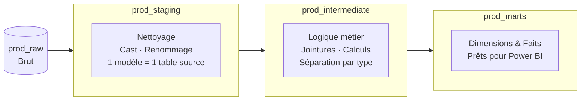
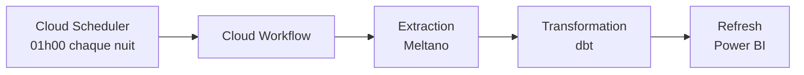

# Notre stack ELT — Vue d'ensemble

**Audience :** Data Analyst / Data Engineer en onboarding
**Dernière mise à jour :** 2026-04-02

---

## Le grand schéma

```mermaid
flowchart LR
    subgraph SRC["Systèmes sources"]
        direction TB
        s1["Oracle Neshu\nERP principal"]
        s2["Oracle LCDP\nERP secondaire"]
        s3["MSSQL Sage\nComptabilité"]
        s4["Yuman\nInterventions terrain"]
        s5["Nespresso\nAPIs partenaires"]
        s6["SFTP / GCS\nFichiers"]
    end

    subgraph ELT["Google Cloud Platform"]
        direction TB
        meltano["Meltano\nExtraction"]
        raw[("BigQuery\nprod_raw\nDonnées brutes")]
        dbt["dbt\nTransformation"]

        subgraph DWH["BigQuery — Data Warehouse"]
            stg[("prod_staging")]
            int[("prod_intermediate")]
            mrt[("prod_marts")]
            stg --> int --> mrt
        end

        meltano --> raw --> dbt --> stg
    end

    pbi["Power BI\nRapports"]

    SRC -->|"chaque nuit"| meltano
    mrt --> pbi
```



---

## Comment ça fonctionne — en 4 étapes

### 1. Extraction — Meltano lit les sources

**Meltano** est un outil open source qui se connecte aux différents systèmes d'EVS (bases Oracle, MSSQL, APIs REST, fichiers) et copie les données dans BigQuery, sans modification.

> Les sources on-premise (Oracle, MSSQL) sont dans les locaux d'EVS. Meltano y accède via le cloud GCP.

---

### 2. Stockage brut — BigQuery `prod_raw`

Tout atterrit dans `prod_raw`, organisé par source. C'est la **copie fidèle** des données sources.

```
prod_raw
├── oracle_neshu.*    ← tâches, clients, machines, produits, ressources
├── oracle_lcdp.*
├── mssql_sage.*
├── yuman.*
└── ...
```

> On ne touche jamais `prod_raw`. Si une transformation est mauvaise, on repart toujours de là.

---

### 3. Transformation — dbt en 3 couches

**dbt** transforme les données brutes en tables prêtes pour Power BI, en 3 couches successives.



| Couche | Ce qu'on y trouve |
|---|---|
| `prod_staging` | Tables nettoyées, 1 pour 1 avec les sources |
| `prod_intermediate` | Logique métier, enrichissements, agrégats |
| `prod_marts` | `dim_*` (référentiels) et `fct_*` (faits) pour Power BI |

> On ne saute jamais une couche. Les marts ne lisent jamais `prod_raw` directement.

---

### 4. Orchestration — Cloud Workflows lance tout automatiquement

Chaque nuit, **Cloud Scheduler** déclenche un **Cloud Workflow** qui enchaîne les étapes dans l'ordre.



Si une étape échoue, une alerte email est envoyée automatiquement à l'équipe.

---

### 5. Visualisation — Power BI lit `prod_marts`

Power BI se connecte à BigQuery et lit uniquement `prod_marts`. Les analystes trouvent des tables propres, dénormalisées, prêtes à l'emploi.

---

## Pour aller plus loin

| Document | Contenu |
|---|---|
| `docs/onboarding_oracle_neshu.md` | Guide détaillé de la source principale et de l'architecture dbt |
| `CONTRIBUTING.md` | Workflow de contribution, commandes utiles |
| `dbt docs generate && dbt docs serve` | Graphe de lignage interactif de tous les modèles |
